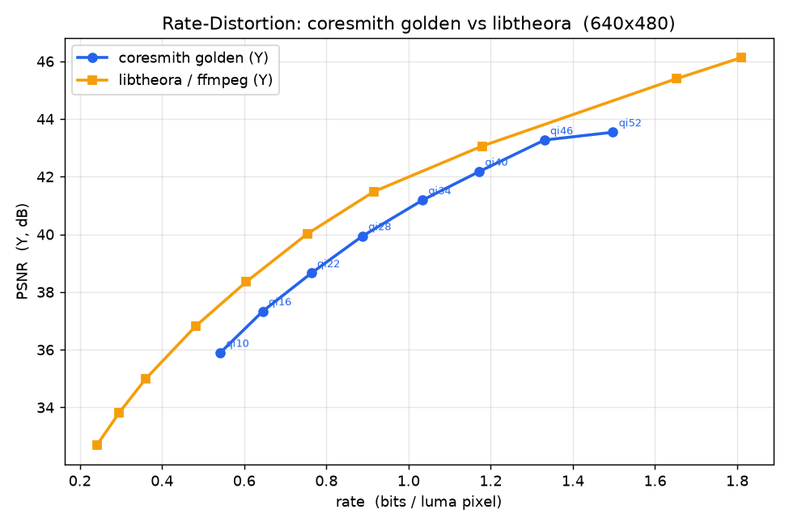
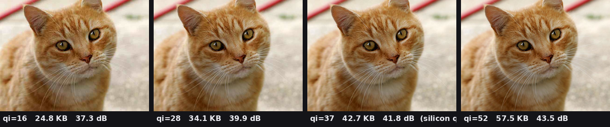
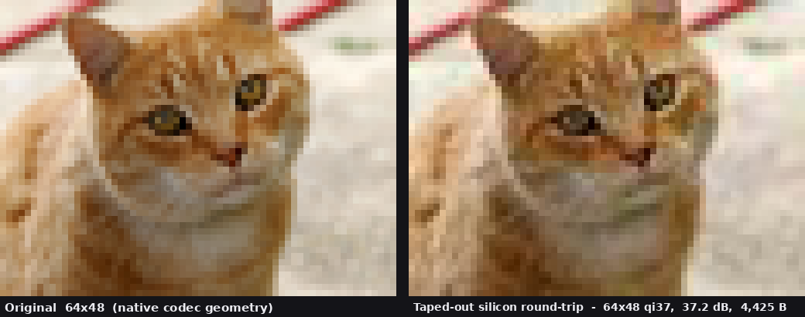

# CoreSmith

[](https://codespaces.new/facebookexperimental/coresmith)

Coresmith converts prompts to silicon. It uses LangGraph to drive the full RTL-to-GDS flow: architecture specification, RTL generation, verification, synthesis, and physical design. You start Coresmith through your agent (Claude or Codex), and it works as a daemon that spawns subagents for you until the GDS is created or your input is required. 

> **Try it:** click the Codespaces badge above for a pre-built sandbox with the full EDA toolchain (Yosys, OpenROAD, Magic, Sky130 PDK) and Claude CLI ready to go. Note that it takes up to ten minutes to boot. Once it boots, launch Claude or Codex in the terminal. You will need to log in to your Claude or Codex account within the codespace.  For your first time, keep it simple: ask for a 32 bit adder.

> \[!NOTE]
> Agentic silicon design is expensive. Every agent needs to reference the full chip specification to accurately architect, implement, and verify their block. Codex Pro (100$/month) or Claude Max (100$/month) is the recommended minimum viable inference provider. Enthusiasts can try using local LLMs (unquantized only) to reduce cost, with severely degraded performance: https://coresmith.ai/blog/qwen-vs-gemma


## What It Does

You provide Coresmith with a specification of the ASIC you want, ideally including a software model for some parts of the design. Coresmith will then decompose your requirements into an ASIC architecture and autonomously drive execution into a GDS. 

1. **Architecture**: Generates a Product Requirements Document (PRD), functional requirements document and system architecture using proxy metrics
2. **Microarchitecture**: Decomposes your requirements and software model into microarchitecture specifications and byte-exact software models using heuristics for data movement and locality
3. **RTL Generation**: An LLM agent converts specifications for every block into synthesizable Verilog
4. **Verification**: Another LLM agent generates cocotb testbenches; Verilator lints and simulates
5. **Synthesis**: Yosys synthesizes each block to a gate-level netlist targeting the SkyWater Sky130 130nm PDK, fixing timing if necessary
6. **Backend**: OpenROAD/Magic/netgen handle place-and-route, DRC, and LVS
7. **Diagnosis**: On failure at any step, a debug agent analyzes the root cause and retries with corrective constraints

The pipeline is interactive via a daemon that exposes endpoints to control the LangGraph pipeline.

### Architecture Phase

The architecture graph gathers requirements, generates specs, and gates the design through human review before RTL generation begins.


### Frontend Pipeline

Each block flows through RTL generation, testbench creation, simulation, and synthesis — with automatic diagnosis and retry on failure.


### Backend Pipeline

Post-synthesis, LLM agents drive place-and-route, DRC, GDS export, and LVS — each with tool-specific fix loops.


## What's New

**Architecture → micro-architecture stage.** The architecture graph decomposes a
design into per-block *micro-architecture* specs before any RTL is written: each
block gets its own uArch spec (interfaces, latency/throughput intent, and a
byte-exact reference model) that the frontend pipeline then implements and verifies
block-by-block. An Amaranth HDL block-model is written for every block, and functionality is validated in a reference model before RTL is written. 

**Complexity-aware decomposition into memory vs compute.** A deterministic,
AST-based pass scores each block's reference slice on four axes (flop count, latency,
data-locality, modeling complexity) and min-cut partitions an over-budget block along
function boundaries -- separating storage-heavy sub-blocks from compute so each stays
inside its per-block area / FF / SRAM budget. Storage that should be a macro is
mapped to an **SRAM macro** (with LEF/GDS/lib injection) rather than synthesized as a
flop array.

**Coverage driven verification.** DV is functional and coverage driven. The DV agents verify targets specified in the functional requirements document and attempt to hit 90% line coverage before proceeding to chip integration.

## PPABench Results
PPABench is a chip design benchmark (github.com/facebookresearch/ppabench).

Five designs were driven from architecture through backend signoff on the SkyWater
Sky130 130nm PDK. **Four of five signed off** (DRC 0, LVS benign-tie match, timing
MET at 50 MHz); one (JPEG) is backend-blocked. Timing is post-route STA setup slack
at the 50 MHz target.

| Design | Coverage | DRC | LVS | Area (util) | Power | Timing @50 MHz |
|--------|----------|-----|-----|-------------|-------|----------------|
| GEMM   | 94.2%      | 0        | match       | 1.06 mm² (41%) | 12.9 mW       | +5.52 ns MET |
| AES    | 98-99% ¹   | 0 †      | match ‡     | 0.31 mm² (26%) | 16.6 mW       | +11.32 ns MET |
| Raster | 96.6%      | 0 †      | match ‡     | 2.32 mm² (39%) | *invalid* §   | +6.42 ns MET |
| FFT    | 95.7%      | 0        | match ‡     | 1.37 mm² (30%) | 31.4 mW       | +7.23 ns MET |
| JPEG   | 84.6% (min)| *blocked*| *not proven*| —              | —             | routed 50 MHz only |

- **¹** AES functional cores are 98-99% (round-core 98.35%, QSPI frontend 98.99%); the small structural wrapper block is 86.7%. FFT aggregate 95.7% (min applicable 90.9%); GEMM/JPEG shown as minimum applicable coverage.
- **†** DRC 0 after documented macro-interior exclusion -- raw Magic tiles fall inside a signed-off standard-cell / SRAM-macro interior.
- **‡** LVS match under benign-tie classification -- constant-tie / replicated top-pins plus zero-transistor tap/fill/decap device-count deltas, each explicitly identified (no unexplained residue).
- **§** Raster power is invalid: an OpenRAM macro-power table returned a nonphysical value; the finite non-macro + leakage subtotal is ~2.26 mW.

CoreSmith can now generate intermediate-complexity out-of-order cores, like intra video encoders or decoders (e.g. Theora) that are byte-exact and decodable by a software oracle. 

### Theora video codec: spec → silicon

A matched Theora **encoder** and **decoder** were each driven from a natural-language spec all the way to Sky130 GDSII and signed off **byte-exact** against a from-scratch golden reference. They are the largest designs in the sweep — the deep on-chip frame memory is realized by tiling SRAM macros, so PPA here is routability-oriented, not area-optimized.

| Design | Functional | DRC | LVS | Area (util) | Power | Timing @50 MHz |
|--------|------------|-----|-----|-------------|-------|----------------|
| Theora encoder | byte-exact (15,637/15,637 B) | 0 † | match ‡ | 4.44 mm² (43%) | *invalid* ※ | MET |
| Theora decoder | byte-exact (161,280/161,280 B, 35 frames) | 0 † | match ‡ | 7.18 mm² (32%) | 6.25 mW | MET |

- **※** Encoder power hit the same nonphysical OpenRAM macro-power-table value as Raster (§); its finite switching + leakage subtotal is ~6.9 mW. The decoder tiles pre-built PDK SRAM macros and reports valid power.


A 640×480 photo encoded, then decoded, through the codec's golden model — which is byte-exact to the taped-out RTL. The reconstructed bitstreams also decode byte-exact in stock `ffmpeg`: the output is conformant Theora, not an approximation.

The silicon codec is fixed-function (64×48 4:2:0, intra-only, qi = 37). For the plots below, the byte-exact golden model was extended to arbitrary geometry (up to 1280×720) and variable quality (qi 0–63); the enhanced streams stay conformant (they decode byte-exact in `ffmpeg`). At equal *rate* the codec tracks ~1.2 dB under `libtheora` — its hardware-friendly entropy coder uses length-1 EOB runs and no trellis (bitrate is not a graded axis); at equal *qi* it quantizes finer (no deadzone) for lower distortion.



Quality scales monotonically with qi:



At its native 64×48 geometry — exactly what was physically taped out — a round-trip through the chip's own codec (both panels 8× nearest-neighbor for visibility; the reconstruction is byte-exact to the RTL):



## LLM Providers
For the best experience: 

* Claude Code Max (minimum 100$/month, ideally 200$/month): use Fable as outer agent, Opus for inner agents
* OpenAI Codex Pro (minimum 100$/month, ideally 200$/month): use Sol-5.6 xhigh for outer agent

For research purposes:

* OpenCode/OpenRouter endpoints are supported, including Kimi K3. 
* Meta Muse Spark is supported via OpenCode: http://dev.meta.ai

Using API rates, budget about 3$-5$ for a simple 3-stage MCU. 

## Setup

Three install paths -- see **[SETUP.md](SETUP.md)** for the full commands and a
reproducible Ubuntu 22.04 reference setup:

- **Option A -- Docker / RunPod / Codespace** (recommended for first-time users): a
  pre-built image with the full EDA toolchain (Yosys, OpenROAD, Magic, Sky130 PDK) +
  the Claude/Codex CLI. Click the Codespaces badge above, or pull the container.
- **Option B -- Local install (Nix-based backend)**: `nix develop` pins every EDA
  tool; run the MCP server or the `coresmithd` daemon + `bin/coresmith` CLI.
- **Option C -- Linux without Nix or Docker (OSS-CAD-Suite)**: install the frontend
  EDA toolchain, Node + Claude CLI, a Python venv, and the Sky130 PDK by hand.

After any path, run `make preflight` -- it checks the Sky130 PDK files and the
`yosys` / `verilator` binaries on `$PATH` and prints exactly what's missing.

## Architecture

The system is built around three LangGraph state machines:

```
Phase 1: ARCHITECTURE        Phase 2: RTL PIPELINE        Phase 3: BACKEND
------------------------    ------------------------     -----------------
User Requirements            Per-block loop:              Post-synthesis:
  |                            uArch Spec                   Place & Route
  v                            RTL + Lint                   DRC
PRD (sizing questions)         Testbench + Sim              LVS
  |                            Synthesis                    Timing Sign-off
  v                            Diagnose / Retry
Block Diagram
  |
  v
Constraint Check -> OK2DEV Gate
  (off by default:
   Memory Map -> Clock Tree -> Register Spec)
```

## Project Structure

```
coresmith/
  orchestrator/           # Core pipeline engine
    architecture/         #   Architecture phase (PRD, block diagram, constraints)
    langchain/            #   LLM agents (RTL gen, testbench, debug, timing)
    langgraph/            #   State machines (architecture, pipeline, backend, tapeout)
    pdk/                  #   PDK configuration
    pdk_templates/        #   EDA tool templates (Yosys, Magic, netgen)
    telemetry/            #   OpenTelemetry tracing
    mcp_server.py         #   MCP server for Claude Code integration
    config.yaml           #   Pipeline configuration
    tests/                #   Test suite
  scripts/                # Toolchain installer, Nix wrappers
  bin/coresmith           # CLI client for the coresmithd HTTP daemon
  orchestrator/daemon/    # coresmithd FastAPI daemon (one per project_root)
  Makefile                # Build targets
  requirements.txt        # Python dependencies
```

## Usage

### Interactive (Claude Code or Codex CLI)

The best way to use Coresmith is through Claude Code or Codex CLI. The CLAUDE.md has all the instructions your agent needs to get started. The coresmith daemon will build your ASIC and escalate any blocking questions up to you.

### Daemon mode (outer agent or human drives)

```bash
bin/coresmith daemon start --project-root $(pwd)
bin/coresmith run start --project-root $(pwd)
bin/coresmith state --project-root $(pwd)
bin/coresmith resume --project-root $(pwd) --action approve
```

The daemon does **not** auto-approve interrupts. An outer agent (Claude on
cron, a human, or another script) drives every decision via `coresmith
resume`. See [CLAUDE.md](CLAUDE.md) for the full decision contract.

### Web UI (live dashboard)

`orchestrator/vscode-ext/serve.py` serves the same ReactFlow dashboard the
VS Code extension provides, but as a plain web page in any browser — the
graph view, a Gantt timeline of every block/node, per-node LLM
trajectories (prompts, tool runs, reasoning), and a browser for generated
collateral (RTL, testbenches, waveforms, GDS reports). It's **read-only**:
it visualizes a daemon run by reading that run's `.coresmith/` event logs,
so it never drives the pipeline.

Because it reads the run's event logs, the webview must point at the **same
project root as the daemon** — it keys off the same `CORESMITH_PROJECT_ROOT`
the daemon uses.

```bash
# 1. Build the webview bundle once (produces dist/webview.js).
#    serve.py exits with an error until this exists.
cd orchestrator/vscode-ext && npm install && npm run build && cd -

# 2. With the daemon already running against $RUN_DIR (see above),
#    start the webview against the SAME project root:
CORESMITH_PROJECT_ROOT=$RUN_DIR python orchestrator/vscode-ext/serve.py --port 3000
```

Then open <http://127.0.0.1:3000>. The page polls the run's logs, so it
updates live as the daemon advances.

**Remote / headless box** (e.g. a cloud runner): `serve.py` binds
`127.0.0.1` by default. Either forward the port with
`ssh -L 3000:localhost:3000 <host>`, or expose it directly with
`--host 0.0.0.0` (or a `cloudflared tunnel --url http://127.0.0.1:3000`).
The daemon and the webview can run in separate shells as long as both
export the same `CORESMITH_PROJECT_ROOT`.

## Testing

```bash
# Run orchestrator tests
source venv/bin/activate
pytest orchestrator/tests/ -v

# Skip tests requiring live LLM
pytest orchestrator/tests/ -v -m "not live_llm"

# Skip tests requiring Nix/EDA tools
pytest orchestrator/tests/ -v -m "not requires_nix and not e2e"
```

## Further reading

- [docs/AUTHENTICATION.md](docs/AUTHENTICATION.md) — Claude Code or OpenCode/OpenRouter (hosted Kimi K3) credentials
- [docs/LOCAL-DEV.md](docs/LOCAL-DEV.md) — running and iterating without containers
- [docs/TROUBLESHOOTING.md](docs/TROUBLESHOOTING.md) — common failures (Yosys version, missing PDK, OpenROAD OOM, …)
- [docs/RUNPOD.md](docs/RUNPOD.md) — hosted runs with a ready-to-paste pod template

## Maintainer

**Tim Balbekov** — balbekov@alum.mit.edu

## Citation

If CoreSmith is useful to you, please cite it:

```bibtex
@software{coresmith2026,
  author  = {Balbekov, Tim},
  title   = {{CoreSmith}: A Prompt to GDS Agentic Flow},
  year    = {2026},
  url      = {https://github.com/facebookexperimental/coresmith}
}
```

## License

MIT License. See [LICENSE](LICENSE) for details.
