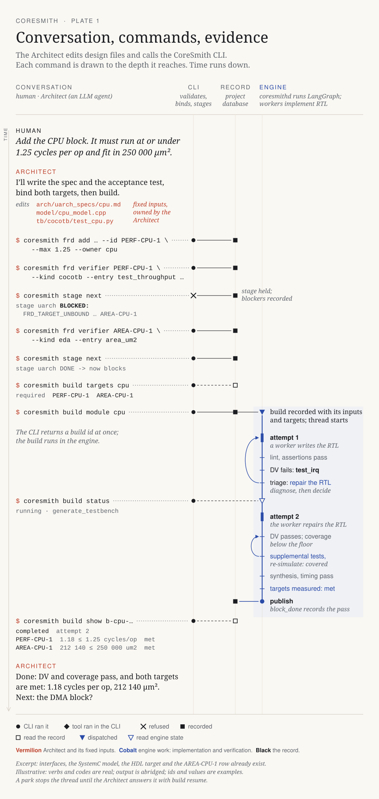

# CoreSmith

The Architect is the agent talking to the human. It uses the CoreSmith CLI to define the chip, launch builds, inspect evidence, and choose the next change.

[Open the plate at full size](assets/architecture-flow.svg)

| Owner | Responsibility |
|---|---|
| Architect | Requirements, interfaces, models, targets, acceptance tests, experiments |
| CLI | Bind inputs, validate changes, enforce stages, launch work |
| LangGraph | Run verification and implementation loops; checkpoint progress |
| Tools | Produce simulation, coverage, synthesis, timing, and physical evidence |

Start with [Workflow](pipeline-overview.md), then [SystemC](systemc.md), [Architecture](architecture-phase.md) and [Module builds](frontend-rtl-pipeline.md).
