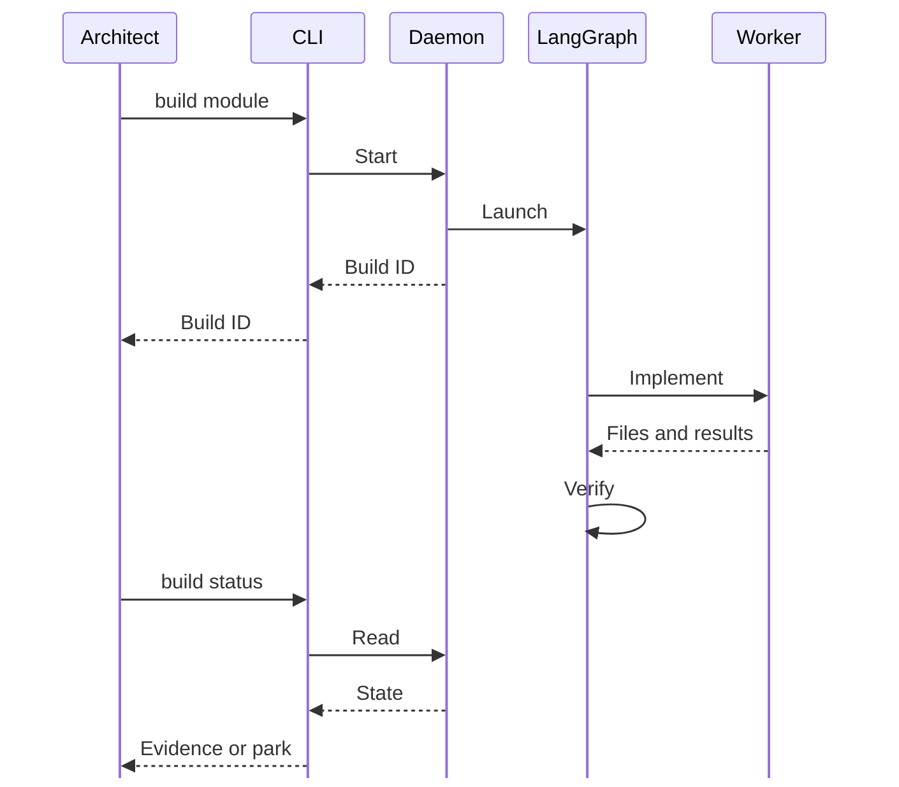
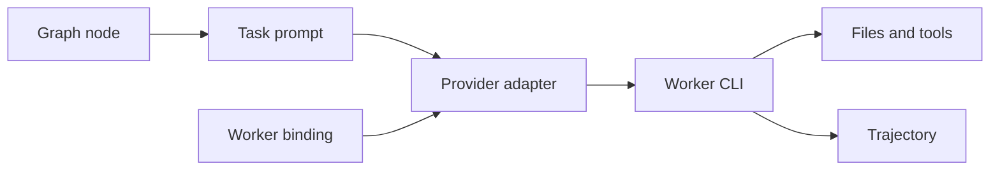

# Agents and models

The Architect uses its own session. Engine workers use the provider and model declared in the project's `.coresmith/env`.



## Worker binding

Declare the provider and its deciding model selector before starting the daemon; the selected native CLI and its credentials must be available on that host.

```dotenv
CORESMITH_LLM_PROVIDER=claude
CORESMITH_MODEL=your-model-id
```

| Provider | Model selectors, in precedence order |
|---|---|
| `claude` | `CORESMITH_MODEL` |
| `codex` | `CORESMITH_CODEX_MODEL`, `CORESMITH_MODEL` |
| `opencode` | `CORESMITH_OPENCODE_MODEL`, `CORESMITH_MODEL` |
| `kimi` | `KIMI_MODEL_NAME`, `CORESMITH_KIMI_MODEL`, `CORESMITH_MODEL` |
| `agy` | `CORESMITH_AGY_MODEL`, `CORESMITH_MODEL` |

## Dispatch



Graph builders register nodes with `add_node`; nodes construct the helpers they need. `coresmith_llm.py` owns provider aliases and model selection, and the build record stores the resolved worker binding.

Code: `orchestrator/langchain/agents/coresmith_llm.py`, `orchestrator/state_store/builds.py`, `orchestrator/langchain/prompts/`.
