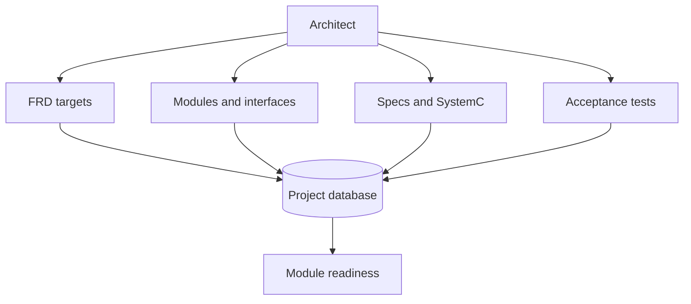
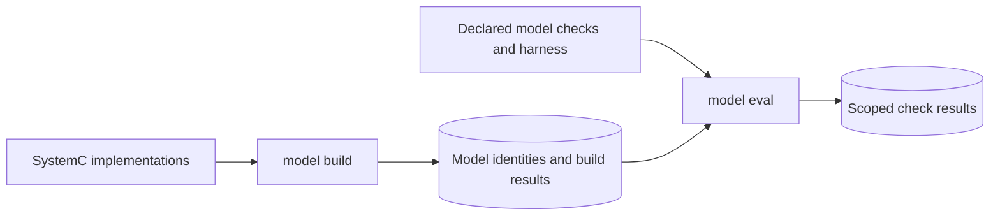

# Architecture

The Architect writes the design contract before implementation. Registration validates and hashes inputs; `schema` shows the accepted shape.



| Input | CLI |
|---|---|
| Requirements | `prd`, `frd`, `register prd`, `register frd` |
| Modules and architecture | `register block_diagram`, `register sad` |
| Interfaces and ABI | `contract`, `register contracts`, `register abi` |
| Fabric and chip pins | `fabric`, `pin` |
| Module specification | `register uarch --block cpu arch/uarch_specs/cpu.md` |
| HDL top and sources | `target bind cpu --file targets/cpu.json` |
| Acceptance and measurements | `frd verifier` |

The fabric build generates wrappers from vendored IP; contracts and pins define the chip shell.

## HDL binding

`targets/cpu.json` declares the actual HDL top and the sources used by module tools; the first source is the worker's output path.

```json
{
  "top": "cpu_top",
  "sources": ["rtl/cpu.v"],
  "include_dirs": [],
  "defines": [],
  "parameters": {},
  "assets": []
}
```

## SystemC reference model

[SystemC workflow and readiness gate](systemc.md).

Supply `model/<block>_model.cpp` and its header, then compile and smoke the assembled model; the build records each module's model identity and local dependencies.



```bash
coresmith schema uarch --json
coresmith model build --json
coresmith model eval --json
coresmith vip generate --json
coresmith shell assemble --json
coresmith stage status --json
```

`model eval` checks the supplied harness; `model author --block cpu` and `harness author` explicitly request worker help. The optional `model ... --arch` path builds an abstract performance model from `model/arch/arch_model.json`.

Code: `orchestrator/harness/targets.py`, `orchestrator/harness/tools/register.py`, `orchestrator/harness/tools/integrate.py`.
