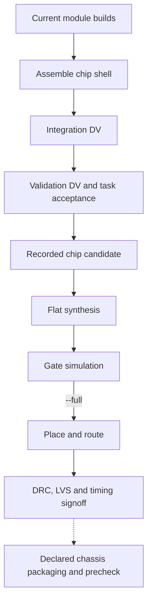

# Integration and backend

`coresmith run start` requires the stage machine to have reached `blocks`; it reuses current completed module builds and drives chip integration and validation. Chip verdicts bind to the module builds and the integrated top's bytes.

| Command | Work |
|---|---|
| `coresmith run start` | Frontend composition, integration, validation |
| `coresmith backend start` | Flat synthesis and gate simulation |
| `coresmith backend start --full` | Continue through physical design and signoff |
| `coresmith backend state` | Results and pending backend decisions |

`backend start` stops after gate simulation unless `--full` is supplied. Backend inputs come from the recorded candidate; changes to its RTL require adoption and fresh evidence.

| Claim | Required evidence |
|---|---|
| Module works | Current module build and its checks |
| Chip meets the workload | Current integration and task acceptance results |
| Physical design closes | Timing, DRC and LVS verdicts for the current candidate |

Code: `orchestrator/langgraph/pipeline_graph.py`, `orchestrator/harness/top_module.py`, `orchestrator/langgraph/backend_graph.py`, `orchestrator/langgraph/tapeout_graph.py`.
