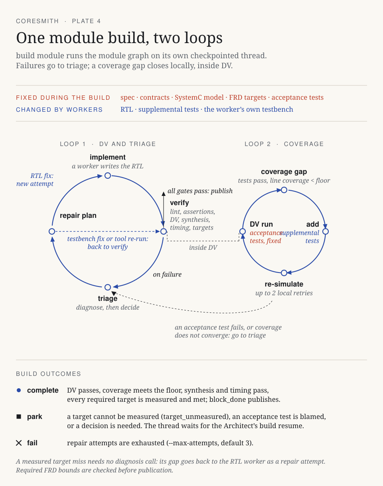

# Module builds

`coresmith build module cpu` records the inputs and runs the module LangGraph. The default build asks a worker to implement the RTL; `--seed-rtl rtl/cpu.v` explicitly imports an existing implementation.

[](assets/module-build-loops.svg)

[Open the plate at full size](assets/module-build-loops.svg)

Verification: lint → assertions → acceptance tests and coverage → synthesis and timing → FRD targets.

A failure goes to triage: the graph diagnoses it, then repairs the RTL (a new attempt), repairs a worker-owned testbench, or re-runs a tool. When the acceptance tests pass but line coverage is below the floor, a helper adds supplemental tests and the simulation re-runs; this loop stays inside DV.

| Fixed input | Worker output |
|---|---|
| Registered uArch spec and reference model | RTL implementation |
| HDL target, interface contracts, memory bindings | Assertions for the supplied invariant IDs |
| FRD targets and bound acceptance tests | Supplemental coverage tests |

The registered acceptance files stay fixed; generated fabric tests also stay fixed during coverage closure. A diagnosis that blames an acceptance test parks for the Architect. Without bound acceptance tests, the testbench worker authors the module tests.

```bash
coresmith build targets cpu --json
coresmith build module cpu --max-attempts 3 --json
coresmith build status --json
coresmith build show BUILD_ID --json
```

A build completes when DV, coverage, synthesis, timing and every required [target](targets-and-experiments.md) pass. A changed spec, model, target, or acceptance input requires a new build. Publication checks the recorded inputs, graph execution, and measured receipts; `block-done` remains a diagnostic and cannot complete the stage.

Code: `orchestrator/module_build.py`, `orchestrator/langgraph/pipeline_graph.py`, `orchestrator/state_store/builds.py`.
