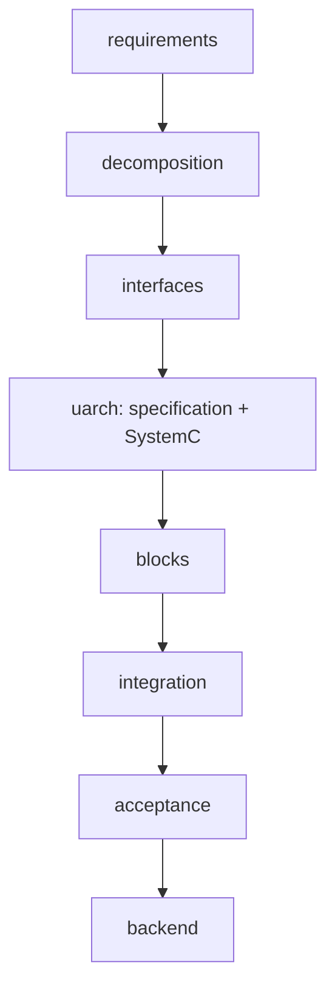
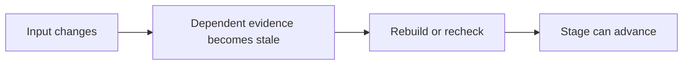

# Workflow

`coresmith stage next` checks the current stage before advancing. `coresmith stage status --json` reports missing or stale evidence.

| Stage | Exit evidence |
|---|---|
| requirements | Registered requirements and acceptance criteria |
| decomposition | Registered modules and system architecture |
| interfaces | Contracts, ABI, pins, generated VIP, elaborated shell |
| uarch | Every module's spec, bound HDL target, current reference model, worker binding |
| blocks | A current, completed graph build for every module |
| integration | Current composition passes integration DV |
| acceptance | Current composition passes validation DV |
| backend | Current composition has the required backend verdict |

[SystemC](systemc.md) is a required part of `uarch`: build and smoke the reference model, then pass every declared model check. The CLI keeps the stage name `uarch`.

A module can build once the shared architecture stages and that module's inputs are ready; other modules may still be in preparation. A failed implementation shell still permits a repair build.

Code: `orchestrator/state_store/stages.py`, `orchestrator/module_build.py`.
