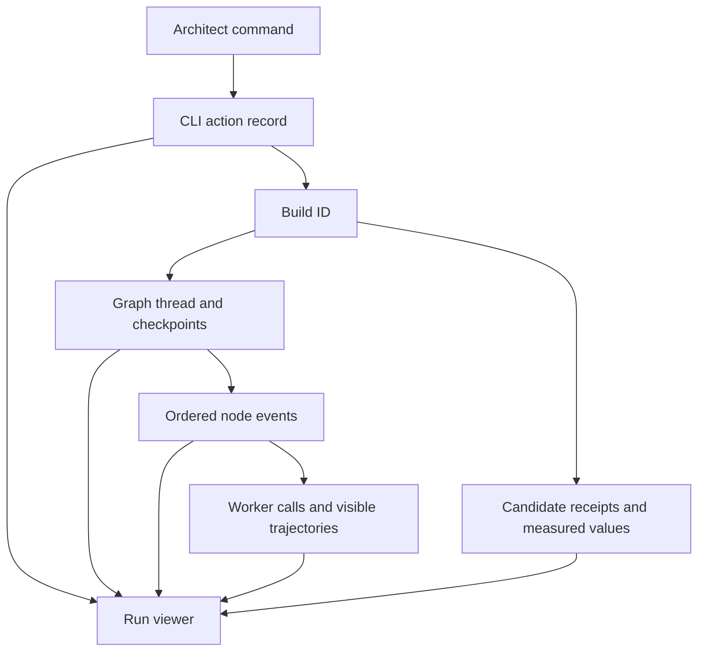

# Evidence and trajectories

The database records decisions and results; checkpoints record graph progress; files hold the design and tool evidence. A worker's success message does not establish a design pass.



| Path | Contents |
|---|---|
| `.coresmith/project.sqlite` | Requirements, bindings, stages, builds, candidates, checks, actions, parks |
| `.coresmith/*_checkpoint.db` | LangGraph state and pending work |
| `.coresmith/pipeline_events*.jsonl` | Graph node events, including rotated logs |
| `.coresmith/llm_calls.jsonl` | Worker calls and reported usage |
| `.coresmith/builds/<id>/candidates/` | Candidate snapshots and copied evidence |
| `.coresmith/step_logs/` | EDA commands and output |
| `arch/`, `model/`, `rtl/`, `tb/` | Design inputs and implementations |

```bash
coresmith actions --all --json
coresmith build lineage --json
coresmith build show BUILD_ID --json
coresmith stage status --json
```

## Viewer

Run from the engine checkout; the collector expects a study directory containing `arms/<name>/work` and captured native sessions.

```bash
python3 -m tools.run_viewer.collect_study --study STUDY --arm NAME --output SNAPSHOT
python3 -m tools.run_viewer.export --snapshot SNAPSHOT --out VIEWER
python3 -m tools.run_viewer.verify --snapshot SNAPSHOT --viewer VIEWER
python3 -m http.server --bind 127.0.0.1 8765 --directory VIEWER
```

The viewer shows CLI calls, graph loops, Architect sessions, native subagents, engine workers, and tool evidence; relationships carry `exact`, `strong`, `weak`, `ambiguous`, or `unlinked` labels. It exposes captured visible records and reports missing data; a snapshot cannot prove freshness against files changed afterward.

Code: `orchestrator/state_store/`, `orchestrator/graph_lifecycle.py`, `tools/run_viewer/`.
