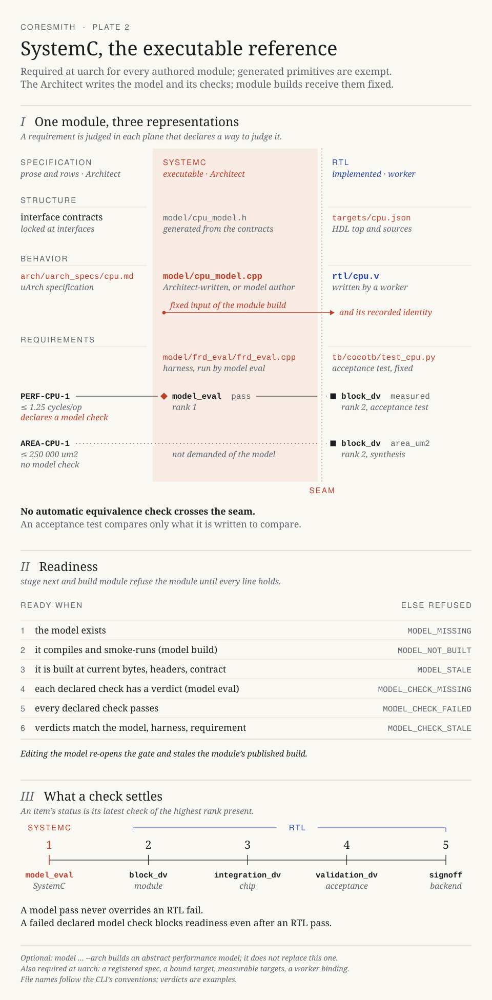

# SystemC

SystemC is the executable reference before RTL implementation. The Architect owns the model and its checks; module workers receive the recorded model as a fixed input.

[](assets/systemc-flow.svg)

[Open the plate at full size](assets/systemc-flow.svg)

## Build and evaluate

Supply `model/<block>_model.cpp` and its header, or use an explicitly registered model path. Author directly or request worker help with `model author --block <name>`; checks do not author the model.

```bash
coresmith model build --json
coresmith model eval --json
coresmith stage status --json
coresmith build module cpu --json
```

| Gate | Required evidence |
|---|---|
| Model build | Successful compilation and smoke run |
| Identity | Current implementation, local dependencies, and contract version |
| Declared model checks | Passing verdicts bound to the current model, harness, and requirement |
| Module build | Ready specification, target, model, checks, and worker binding |

Missing, failed, or stale required evidence blocks the module. Changing a model requires rebuilding its evidence and starting a new module build.

## What the result means

`model eval` evaluates the supplied harness. Compilation alone proves neither behavior nor RTL equivalence; the verification harness must make the intended comparisons.

The optional `model ... --arch` path evaluates an abstract performance model. It does not replace the required SystemC reference model. Throughput, area, and power targets remain linked to the FRD; implementation measurements decide the module's target verdicts.

SystemC readiness lives in the engine's `uarch` stage. See [module builds](frontend-rtl-pipeline.md) for the implementation loop.

Code: `orchestrator/state_store/stages.py`, `orchestrator/state_store/builds.py`, `orchestrator/harness/tools/integrate.py`.
