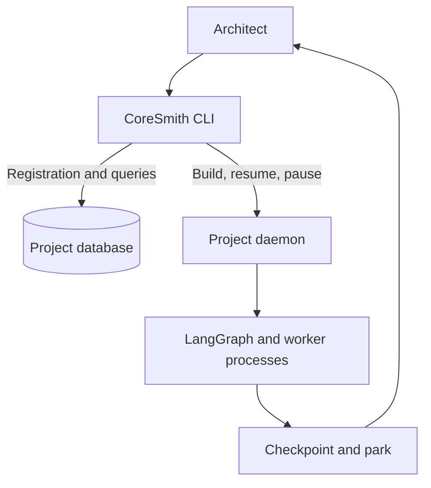
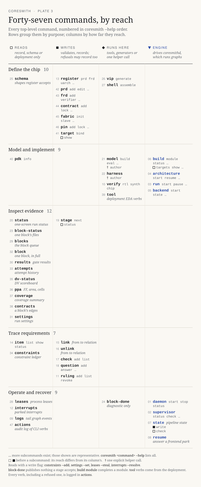

# CLI and operation

Use one project root for the Architect, daemon, workers, and evidence. Module builds run one at a time per project; a running pipeline or backend also holds the workspace.



## Command inventory

Every command below starts with `coresmith`. Use `<command> --help` for its arguments; `tool --help` lists the deployment's EDA verbs.

[](assets/cli-inventory.svg)

[Open the plate at full size](assets/cli-inventory.svg)

| Purpose | Top-level commands |
|---|---|
| Define the chip | `schema`, `register`, `prd`, `frd`, `contract`, `fabric`, `pin`, `target`, `vip`, `shell` |
| Model and implement | `model`, `harness`, `build`, `architecture`, `run`, `backend`, `verify`, `tool`, `pdk` |
| Inspect evidence | `status`, `stage`, `block-status`, `blocks`, `block`, `results`, `attempts`, `dv-status`, `ppa`, `coverage`, `contracts`, `settings` |
| Trace requirements | `item`, `link`, `unlink`, `check`, `question`, `ruling`, `constraints` |
| Operate and recover | `daemon`, `supervisor`, `leases`, `state`, `resume`, `interrupts`, `logs`, `actions`, `block-done` |

`build` provides `module`, `targets`, `status`, `resume`, `pause`, `abort`, `list`, `show`, `compare`, and `lineage`. `block-done` is diagnostic; it cannot complete the `blocks` stage.

## Prepare

With `coresmith` on `PATH`, set the project root and [worker binding](agents-and-models.md), then register the [architecture inputs](architecture-phase.md).

```bash
export CORESMITH_PROJECT_ROOT=/path/to/project
coresmith daemon start
coresmith schema --json
coresmith stage status --json
coresmith stage next --json
```

Resolve the reported blockers between stage advances.

## Build and inspect

```bash
coresmith build targets cpu --json
coresmith build module cpu --json
coresmith build status --json
coresmith build list --module cpu --json
coresmith build show BUILD_ID --json
coresmith build compare BUILD_A BUILD_B --json
```

## Answer a park

Read the park's `supported_actions` and answer through its lifecycle.

| Lifecycle | Inspect | Answer |
|---|---|---|
| Module build | `build status --build-id BUILD_ID` | `build resume --build-id BUILD_ID --action ACTION` |
| Frontend | `state` | `resume --interrupt-id ID --action ACTION` |
| Backend | `backend state` | `backend resume --interrupt-id ID --action ACTION` |

| Condition | Next step |
|---|---|
| Missing input or binding | Register it; retry the command |
| Failed implementation | Repair or retry within the fixed contract |
| Changed spec or acceptance test | Register the revision; start a new build |
| Missing measurement | Repair the tool environment; retry measurement |
| Paused build | Resume its recorded checkpoint |

## Tools and monitoring

```bash
coresmith tool --help
coresmith tool run_lint --rtl rtl/cpu.v --json
coresmith status --json
coresmith supervisor status
```

The optional supervisor checks daemon health and can launch the frontend once the stage reaches `blocks`; decisions remain with the Architect. MCP exposes another route to engine tools; the Architect workflow uses the CLI.

Code: `bin/coresmith`, `orchestrator/harness/cli.py`, `orchestrator/daemon/server.py`, `orchestrator/daemon/supervisor.py`.
