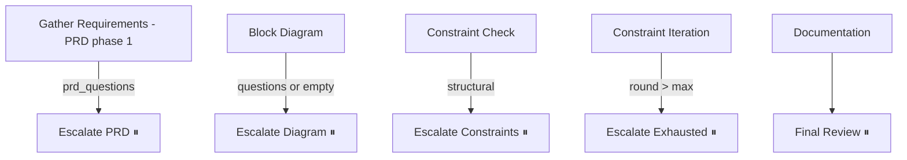

# Architect escalation

The architecture graph never auto-approves. When the LLM produces an answer that the system cannot validate by itself, or when the constraint checker finds something the LLM cannot fix in another auto round, the graph parks on an interrupt and waits for the architect to resume it.

This page covers *how* the escalation happens — the trigger, the payload, and the resume contract.

## The five escalation points



| Interrupt node | Triggers when | Payload type | `supported_actions` |
|---|---|---|---|
| `escalate_prd_node:1614` | PRD phase 1 produced sizing questions | `prd_questions` | `continue`, `abort` |
| `escalate_diagram_node:1714` | Block diagram returned questions, or returned no blocks | `architecture_review_needed` | `continue`, `feedback`, `abort` |
| `escalate_constraints_node:1767` | `constraint_result.has_structural == True` | `architecture_review_needed` | `retry`, `accept`, `feedback`, `abort` |
| `escalate_exhausted_node:1835` | `round > max_rounds` or `total_rounds > max_rounds*3` | `architecture_review_needed` | `retry`, `accept`, `feedback`, `abort` |
| `escalate_final_review_node:1483` | After `Create Documentation` completes (OK2DEV gate) | `final_review` | `accept`, `feedback`, `abort` |

## Payload structure

All five escalations share a common header:

```python
{
  "type": "prd_questions" | "architecture_review_needed" | "final_review",
  "phase": str,                          # one of prd/sad/.../finalize/documentation
  "round": int,                          # current constraint round
  "max_rounds": int,                     # max allowed rounds
  "supported_actions": list[str],
  ...                                    # payload-type-specific fields
}
```

Type-specific fields:

| Field | Where it appears | Meaning |
|---|---|---|
| `questions` | PRD phase 1, block diagram escalation | List of `{question, category, suggested_default}` |
| `violations` | constraint / exhausted escalations | List of `{violation, category, check, severity}` |
| `violations_history` | constraint / exhausted escalations | All violations from all prior rounds (audit trail) |
| `block_diagram_summary` | constraint / exhausted escalations | Compact summary of current blocks/connections |
| `block_specs_path` | final review | Path to the `block_specs.json` the architect should review |
| `block_diagram_doc_validation_errors` | final review | Any errors in the ReactFlow visualization |
| `prd_summary` / `sad_summary` / `frd_summary` | final review | Section summaries for the architect to skim |

The payload is JSON-serialized and persisted as part of the LangGraph checkpoint. The outer agent reads it via `GET /architecture/state` (the daemon route) or `get_architecture_state` (the MCP tool).

## Resume contract

The outer agent calls one of:

- `POST /architecture/resume` with body `{action, feedback, rationale}`
- `coresmith architecture resume --action <action> [--feedback ...] [--rationale ...]`
- MCP `resume_architecture(action, feedback, rationale)`

The daemon parses the request, builds a resume value dict, and calls `GraphLifecycle.safe_resume(...)` (`graph_lifecycle.py:217`), which:

1. Reads pending interrupt IDs from the checkpoint.
2. Builds `{interrupt_id: resume_value}`.
3. Resumes the graph as a background task with the same `thread_id`.

The interrupt node receives `resume_value` as the return of `interrupt(...)`, and the router function that follows reads `state["human_response"]["action"]` to pick the next node.

## What each action does

### `continue`

Used by PRD phase 1 escalation and the block-diagram escalation. The architect has answered the questions (passed in `feedback` as JSON). The graph proceeds to the next phase.

### `accept`

Used by constraint, exhausted, and final-review escalations. The architect is choosing to proceed *despite* the violations. The constraint result is recorded in history; the graph routes to `Finalize Architecture` (or `Architecture Complete` for OK2DEV).

### `retry`

Used by constraint and exhausted escalations. The architect wants another auto round. For `Escalate Exhausted`, the `round` counter is reset to 1 (the architect is granting another full budget), but `total_rounds` is *not* reset (the hard ceiling remains `max_rounds * 3`).

### `feedback`

The architect provides written feedback (`feedback` field). The graph routes to `Block Diagram` (for constraint/diagram escalations) or to the targeted spec node (for final review). The text is propagated via `state["human_feedback"]` and embedded in the next LLM prompt.

For final review, the router `_feedback_revision_target():291` inspects the feedback text:

- Mentions "PRD" → re-enter `Gather Requirements` (phase 2)
- Mentions "SAD" → `System Architecture`
- Mentions "FRD" → `Functional Requirements`
- Default → `Block Diagram`

### `abort`

Always terminates the graph via the `Abort` node.

## The audit trail

Every architect decision is appended to `state["human_response_history"]` via the `operator.add` reducer (`Fix #7` in the file header). This list is part of every escalation payload, so each subsequent escalation can show the architect their prior decisions.

This is also persisted in the checkpoint, so `coresmith architecture state` always shows the full history regardless of how many times the daemon was restarted.

## How "questions for the architect" are produced

`prd_questions` (the PRD phase 1 escalation) is the only place where the architect is *directly asked questions*. The questions come from the PRD prompt itself (`prompts/prd_spec.md`), which instructs the LLM to enumerate sizing questions across six categories: technology, speed & feeds, area, power, dataflow, validation KPIs.

For the other escalations, the architect sees structured payloads, not questions:

- **Block diagram** — the LLM emits `questions` *in addition to* writing blocks, when it can't unambiguously resolve part of the diagram. The questions are descriptive ambiguities ("Should the input AXI-Stream be 32-bit or 64-bit?"), not yes/no votes.
- **Constraints** — the architect sees a list of violations. They are expected to either feedback ("relax the SRAM budget"), accept ("it's fine, the budget is a soft target"), or retry ("LLM, try again").
- **Final review** — the architect sees the final document set and either signs off, requests changes via feedback, or aborts.

## Where the architect can "ask back"

There is no two-way conversation in the resume protocol — the architect picks an action and the graph proceeds. To probe deeper, the architect (or the outer agent on cron) uses the MCP server's read-only tools to inspect:

- `get_architecture_state()` — current snapshot.
- `get_node_prompt(node_id)` — the system prompt for any node.
- `get_graph_structure()` — full topology dump.
- The on-disk files under `<project_root>/arch/`, `.coresmith/`.

That's the introspection surface. To *change* the run, the architect provides written feedback through `resume_architecture(action="feedback", feedback="...")`, which the LLM then incorporates in the next round.

## Operational example: triaging a `STRUCTURAL` violation

1. Daemon shows `pending_interrupt_count: 1` with `interrupt_type: architecture_review_needed`.
2. `coresmith architecture state` prints the payload — the architect sees a `gpio_pad_budget` violation: 52 pads requested, 44 available on the shuttle.
3. Architect inspects `arch/block_diagram.md` and the interface declarations in `arch/uarch_specs/*.md`.
4. Decides: the design genuinely needs all 52 pads, but four of them can be muxed onto two pins. Sends `coresmith architecture resume --action feedback --feedback "Mux camera_data[3:0] onto two pins via DDR; mux i2s_lr onto a single pin via i2s_sclk negedge."`.
5. Graph re-enters `Block Diagram` with the feedback in state. The LLM revises the design.
6. Constraint check re-runs. If the pad count now fits, the graph proceeds; otherwise the cycle repeats.

The interrupt contract is intentionally simple — every escalation either takes a decision or takes free-form text. Anything more structured is reified in the payload, not in the resume call.
