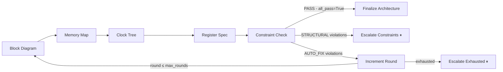

# Constraint checking

The constraint checker is the bridge between the architecture phase and the pipeline phase. It runs after all the per-specialist nodes (block diagram, memory map, clock tree, register spec) have produced their artifacts, and it decides whether the design is internally consistent enough to hand off to the frontend pipeline.

Source: [`orchestrator/architecture/constraints.py`](https://github.com/facebookexperimental/coresmith/blob/main/orchestrator/architecture/constraints.py) (~1190 lines).

## Where it runs in the graph



Entry point: `constraint_check_node:1137` in `architecture_graph.py`, which calls `check_constraints(...)` in `constraints.py`.

## What it checks

Twelve constraint categories. Some are deterministic Python checks; the rest are flagged by an LLM that reads the same artifacts plus rule text in the prompt.

### Deterministic checks

| # | Check | What it verifies |
|---|---|---|
| 10 | **GPIO pad budget** (shuttle-only) | `_count_block_io_pads()` counts pads claimed across blocks. Compared against `_get_shuttle_limits().usable_io_pads`. Structural/error if overflow; warning at >90% utilization. (`constraints.py:124-157`) |
| 11 | **Shuttle area fit** (shuttle-only) | Estimated die area ≤ shuttle user area. Assumes ~200K gates/mm² at 60% utilization. Structural/error if exceeded. (`constraints.py:159-211`) |
| 12 | **Derived geometry** | Cross-checks block/source dimensions, columns/rows, coordinate ranges, transaction counts, field widths. Catches codec-style transposition bugs (e.g. width-derived columns and height-derived rows swapped). (`constraints.py:566-687`) |

### LLM-driven checks

The LLM gets the rule text embedded in the prompt and produces structured violations.

| # | Check | What it verifies |
|---|---|---|
| 1 | **Peripheral count** | Nibble-decode bus allows ~8–15 peripherals max. |
| 2 | **Memory overlap** | No two address regions overlap. |
| 3 | **SRAM budget** | Total SRAM usage ≤ ERS `sram_budget_kb`. |
| 4 | **Clock domain crossings** | If multiple clock domains, every cross-domain connection needs an explicit CDC module. |
| 5 | **Gate budget** | Total estimated gates ≤ ERS `max_gate_count` (default 2M). |
| 7 | **Register spec ↔ memory map** | Register spec blocks must match memory map peripherals. |
| 8 | **Per-block CDC membership** | Every block belongs to exactly one clock domain. |
| 9 | **Data width consistency** | Source width = dest width on every connection, or an explicit adapter block exists. |

### Hybrid

| # | Check | Note |
|---|---|---|
| (deterministic) | **Performance / cycle budget** | Cycle-count claims vs clock × FPS × dimensions. |
| 6 | **Tier assignment reasonableness** | LLM judgment call — e.g. an FFT block shouldn't be tier 1. |

## How a check actually runs

`check_constraints(...)` (`constraints.py:831`):

1. Run the deterministic checks first; collect their violations.
2. Build the LLM user message: concatenate the requirements, block diagram JSON, memory map, clock tree, register spec, benchmark data, and any project markdown documents (`arch/prd_spec.md`, `arch/sad_spec.md`, etc.).
3. Build the LLM system prompt from `prompts/constraint_check.md`, with template variables `{bus_rules}` (lines 949-965) and `{additional_rules}` (lines 977-1004).
4. Call `ClaudeLLM(model=DEFAULT_MODEL, timeout=600).call(system=..., prompt=...)`.
5. Parse the LLM response (`_parse_response`) as structured JSON.
6. Merge LLM violations with deterministic ones — drop LLM violations that duplicate a `check` already produced deterministically.
7. Return a `constraint_result` dict.

## The violation shape

```python
{
    "violation": str,                        # human-readable description
    "category": "structural" | "auto_fixable",
    "check": str,                            # short rule key (e.g. "gpio_pad_budget")
    "severity": "error" | "warning",
}
```

The `category` is what drives routing:

- `structural` — the architecture is incompatible with itself; an LLM revision is unlikely to fix it without architect input. Routes to `Escalate Constraints`.
- `auto_fixable` — the LLM can probably fix this if it sees the violation as feedback on the next round.

The `severity` is informational; warnings don't block the gate.

## The output dict

```python
constraint_result = {
    "violations": list[Violation],
    "all_pass": bool,           # True iff violations is empty
    "has_structural": bool,     # True if any v.category == "structural"
    "category": list[str],      # all categories seen (e.g. ["structural", "auto_fixable"])
}
```

## Routing on the result

`route_after_constraints:2040`:

| Verdict | Next node | Outer-agent involvement |
|---|---|---|
| `PASS` (`all_pass`) | `Finalize Architecture` | none |
| `STRUCTURAL` (`has_structural`) | `Escalate Constraints` interrupt | architect picks `retry`, `accept`, `feedback`, or `abort` |
| `AUTO_FIX` | `Constraint Iteration` | none — graph re-enters `Block Diagram` with violations as feedback |

The auto-fix loop is bounded: `route_after_increment:2142` enforces both a per-round budget (`round <= max_rounds`) and a lifetime budget (`total_rounds <= max_rounds * 3`). Hitting either triggers `Escalate Exhausted`, which always involves the architect.

## Data sources

The checker cross-references everything written by upstream specialists:

| Source | Field consulted |
|---|---|
| `block_diagram` dict | blocks, interfaces, connections, estimated_gates |
| `memory_map` dict | peripherals, address allocations |
| `clock_tree` dict | domains, crossings |
| `register_spec` dict | register_blocks |
| `ers_spec` dict | area_budget (max_die_area_mm2, max_gate_count), dataflow (bus_protocol, sram_budget_kb), speed_and_feeds (target_clock_mhz), technology |
| Project filesystem | `arch/prd_spec.md`, `sad_spec.md`, `frd_spec.md`, `block_diagram.md`, `ers_spec.md`, `arch/uarch_specs/*.md` |

The deterministic checks pull constants from `_get_shuttle_limits()` (lines 34–60) and `_extract_sram_budget_kb()` (lines 1138–1176).

## Graceful failure

If the LLM call itself fails (timeout, parse error, circuit breaker), `check_constraints` returns the deterministic violations plus a warning-level violation recording the LLM error (`constraints.py:1097-1109`). The pipeline still gets a usable result rather than crashing the architecture graph.

## Constraints are not architect questions

A *violation* is not the same as a *question for the architect*. The constraint check just classifies what's broken. Whether that needs human input depends on:

- `category` — `structural` violations always escalate.
- `round` — even `auto_fixable` violations eventually escalate when the auto-fix budget is exhausted.

The actual escalation mechanism is documented in [Architect escalation](architect-escalation.md).
