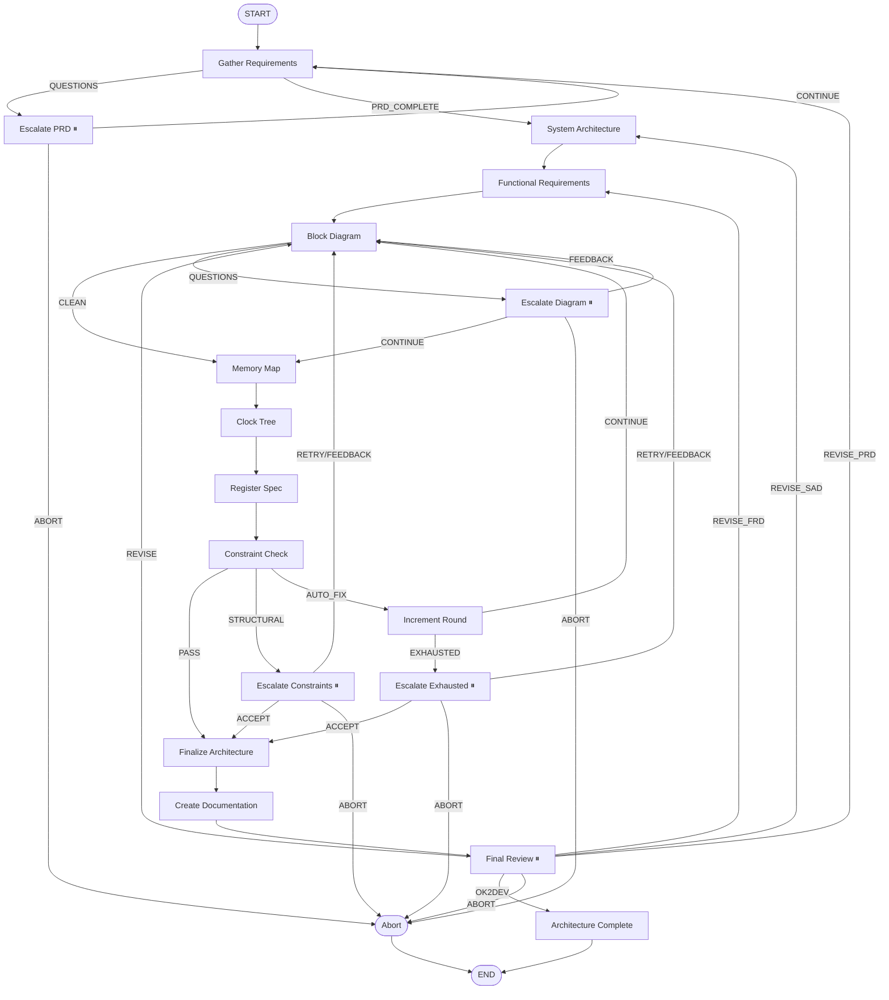

# Architecture graph

The architecture graph turns a free-form `requirements.md` into a complete design package: PRD, SAD, FRD, block diagram, optional memory map / clock tree / register spec, ERS, and a `.coresmith/block_specs.json` that the frontend pipeline consumes. It is the most LLM-heavy of the three graphs and the one most often parked on a human interrupt.

Source: [`orchestrator/langgraph/architecture_graph.py`](https://github.com/facebookexperimental/coresmith/blob/main/orchestrator/langgraph/architecture_graph.py) (~2280 lines), with specialist modules in [`orchestrator/architecture/specialists/`](https://github.com/facebookexperimental/coresmith/tree/main/orchestrator/architecture/specialists/).

## Topology

Five nodes can park the graph on a human-in-the-loop interrupt (marked ⏸). The graph never auto-approves any of them.

## State (`ArchGraphState`)

Defined at `architecture_graph.py:109-163`. The fields fall into six groups.

### Identity (set once)

| Field | Type | Meaning |
|---|---|---|
| `project_root` | `str` | Run directory; all artifacts written under it. |
| `requirements` | `str` | The user-supplied design brief; enriched with PRD summary in phase 2. |
| `pdk_summary` | `str` | Capabilities of the available PDK (used by PRD prompt). |
| `target_clock_mhz` | `float` | Target frequency. |
| `pdk_config` | `dict` | Parsed PDK config dict (cells, libs, density). |
| `max_rounds` | `int` | Max constraint-check rounds before forced escalation. |

### Progress

| Field | Type | Meaning |
|---|---|---|
| `round` | `int` | Current constraint iteration (resets to 1 on retry-after-exhausted). |
| `total_rounds` | `int` | Lifetime counter — never resets. Hard ceiling = `max_rounds * 3`. |
| `phase` | `str` | One of `prd`, `sad`, `frd`, `block_diagram`, `memory_map`, `clock_tree`, `register_spec`, `constraints`, `finalize`, `documentation`. |

### Document outputs

| Field | Type | Written by |
|---|---|---|
| `prd_spec` | `dict?` | `gather_requirements_node` (phase 2) |
| `prd_questions` | `list?` | `gather_requirements_node` (phase 1) — triggers Escalate PRD |
| `prd_answers` | `dict?` | Set by outer agent on resume |
| `sad_spec` | `dict?` | `system_architecture_node` |
| `frd_spec` | `dict?` | `functional_requirements_node` |
| `ers_spec` | `dict?` | `create_documentation_node` |

### Specialist outputs (overwritten each cycle)

| Field | Source specialist | Skippable via env |
|---|---|---|
| `block_diagram` | `block_diagram.py:analyze_block_diagram` | — |
| `memory_map` | `memory_map.py:analyze_memory_map` | `CORESMITH_ENABLE_MEMORY_MAP` |
| `clock_tree` | `clock_tree.py:analyze_clock_tree` | `CORESMITH_ENABLE_CLOCK_TREE` |
| `register_spec` | `register_spec.py:analyze_register_spec` | `CORESMITH_ENABLE_REGISTER_SPEC` |
| `benchmark_data` | external | — |
| `constraint_result` | `constraints.py:check_constraints` | — |

Optional stages are off by default (only the legacy `CORESMITH_SKIP_*` form is set in many existing run scripts). The `_stage_enabled()` helper at `architecture_graph.py:75` evaluates whether a stage runs.

### Accumulators (with reducers)

| Field | Reducer | Use |
|---|---|---|
| `violations_history` | `operator.add` | Every constraint violation, every round. |
| `questions` | `operator.add` | Questions accumulated from `block_diagram_node`. |
| `human_response_history` | `operator.add` | Audit trail of every escalation resolution. |

### Terminal & control

| Field | Type | Meaning |
|---|---|---|
| `human_response` | `dict?` | Latest action returned from an interrupt. |
| `human_feedback` | `str` | Free-form feedback text passed back to block diagram. |
| `block_diagram_doc` | `dict?` | ReactFlow visualization JSON (deterministic). |
| `block_diagram_doc_validation_errors` | `list[str]` | Validation errors on the doc — block OK2DEV if non-empty. |
| `block_specs_path` | `str` | `.coresmith/block_specs.json` (handed to the frontend pipeline). |
| `block_diagram_doc_path` | `str` | `.coresmith/block_diagram_viz.json`. |
| `success` | `bool` | Final outcome flag. |
| `error` | `str` | Error message on failure. |

## Nodes

### Document hierarchy

| Node | Function (`architecture_graph.py`) | LLM? | Writes |
|---|---|---|---|
| `Gather Requirements` | `gather_requirements_node` (line 775) | Yes (Claude) | `arch/prd_spec.md`, `.coresmith/prd_spec.json` |
| `System Architecture` | `system_architecture_node` (line 861) | Yes | `arch/sad_spec.md` |
| `Functional Requirements` | `functional_requirements_node` (line 899) | Yes | `arch/frd_spec.md` |
| `Block Diagram` | `block_diagram_node` (line 936) | Yes | `arch/block_diagram.md`, `.coresmith/block_diagram.json` |

`Gather Requirements` is two-phase:

- **Phase 1** drafts sizing questions across technology, speed & feeds, area, power, dataflow, and validation KPIs → fills `prd_questions` → routes to `Escalate PRD`.
- **Phase 2** runs *after* the outer agent resumes with answers and produces the full `prd_spec`.

`Block Diagram` consumes any `human_feedback` (set by Escalate Diagram or Escalate Constraints) and `constraint_feedback` (violations from prior round) so the LLM has the prior round's diagnosis. It can also write `questions` back into state — these are ambiguities the LLM wants resolved before continuing.

### Specialists (skippable)

| Node | Function | Sources |
|---|---|---|
| `Memory Map` | `memory_map_node` (line 999) | block_diagram, target_clock_mhz, ers_spec |
| `Clock Tree` | `clock_tree_node` (line 1046) | block_diagram, target_clock_mhz |
| `Register Spec` | `register_spec_node` (line 1091) | block_diagram, memory_map |

When disabled they return `{"skipped": True, "result": {...}}` and downstream nodes pass through.

### Constraint check

`constraint_check_node` (line 1137) is described in detail in [Constraint checking](../constraints/constraint-check.md). The router `route_after_constraints` (line 2040) sends the graph to one of three places:

| Verdict | Next node | Condition |
|---|---|---|
| `PASS` | Finalize Architecture | `constraint_result.all_pass` |
| `STRUCTURAL` | Escalate Constraints (interrupt) | any violation with `category=="structural"` |
| `AUTO_FIX` | Constraint Iteration | violations exist but all are `auto_fixable` |

### Constraint iteration

`increment_round_node` (line 1583) bumps both `round` and `total_rounds`. `route_after_increment` (line 2142):

- If `round <= max_rounds` *and* `total_rounds <= max_rounds * 3` → `Block Diagram` (try again with violations as feedback).
- Else → `Escalate Exhausted` (interrupt).

The dual counter (`round` resets on retry, `total_rounds` never resets) is `Fix #6` in the file header — it prevents infinite loops where every "retry" escalation starts a fresh round budget.

### Finalize

`finalize_node` (line 1231) writes:

- `<project_root>/.coresmith/architecture_state.json` — the entire ArchGraphState snapshot.
- `<project_root>/.coresmith/block_specs.json` — the filtered block list the frontend pipeline consumes.

### Create documentation

`create_documentation_node` (line 1311) is deterministic for visualization, LLM-driven for the ERS doc:

1. Calls `generate_block_diagram_doc` (`specialists/block_diagram_doc.py`) — pure Python, builds a ReactFlow node-and-edge JSON; also validates it and writes errors into `block_diagram_doc_validation_errors`.
2. Calls `generate_ers_doc` (`specialists/ers_doc.py`) — LLM; merges PRD/SAD/FRD/block diagram/memory map/clock tree/register spec into the ERS.
3. Calls `generate_dashboard` (`specialists/dashboard_doc.py`) — emits the HTML chip-finish dashboard.

The block diagram doc is the file the dashboards consume. If validation fails, the architect should not approve OK2DEV.

### Final review (OK2DEV gate)

`escalate_final_review_node` (line 1483) is the **OK2DEV gate**. It interrupts with payload type `"final_review"` and `supported_actions: ["accept", "feedback", "abort"]`.

If the architect picks `feedback`, `_feedback_revision_target()` (line 291) inspects the feedback text and routes to the earliest specification it criticizes:

- Mentions "PRD" → re-enter `Gather Requirements`
- Mentions "SAD" → `System Architecture`
- Mentions "FRD" → `Functional Requirements`
- Anything else → `Block Diagram`

This is intentional: feedback nearly always touches the lowest spec it criticizes, and re-running upstream specs invalidates downstream ones.

## Edges (full listing)

| From | To | Kind | Router |
|---|---|---|---|
| START | Gather Requirements | direct | — |
| Gather Requirements | Escalate PRD / System Architecture | conditional | `route_after_prd` (line 1915) |
| Escalate PRD | Gather Requirements / Abort | conditional | `route_after_prd_escalation` (line 1937) |
| System Architecture | Functional Requirements | direct | — |
| Functional Requirements | Block Diagram | direct | — |
| Block Diagram | Memory Map / Escalate Diagram | conditional | `review_diagram` (line 1973) |
| Escalate Diagram | Memory Map / Block Diagram / Abort | conditional | `route_after_diagram_escalation` (line 1997) |
| Memory Map | Clock Tree | direct | — |
| Clock Tree | Register Spec | direct | — |
| Register Spec | Constraint Check | direct | — |
| Constraint Check | Finalize / Escalate Constraints / Constraint Iteration | conditional | `route_after_constraints` (line 2040) |
| Escalate Constraints | Block Diagram / Finalize / Abort | conditional | `route_after_constraint_escalation` (line 2069) |
| Constraint Iteration | Block Diagram / Escalate Exhausted | conditional | `route_after_increment` (line 2142) |
| Escalate Exhausted | Block Diagram / Finalize / Abort | conditional | `route_after_exhausted_escalation` (line 2168) |
| Finalize Architecture | Create Documentation | direct | — |
| Create Documentation | Final Review | direct | — |
| Final Review | Architecture Complete / Gather Requirements / System Architecture / Functional Requirements / Block Diagram / Abort | conditional | `route_after_final_review` (line 2103) |
| Architecture Complete | END | direct | — |
| Abort | END | direct | — |

## Interrupts

| Node | Payload `type` | `supported_actions` | Resume target by action |
|---|---|---|---|
| Escalate PRD | `prd_questions` | `continue`, `abort` | continue → Gather Requirements; abort → Abort |
| Escalate Diagram | `architecture_review_needed` | `continue`, `feedback`, `abort` | continue → Memory Map; feedback → Block Diagram |
| Escalate Constraints | `architecture_review_needed` | `retry`, `accept`, `feedback`, `abort` | retry/feedback → Block Diagram; accept → Finalize |
| Escalate Exhausted | `architecture_review_needed` | `retry`, `accept`, `feedback`, `abort` | retry/feedback → Block Diagram (round reset to 1); accept → Finalize |
| Final Review (OK2DEV) | `final_review` | `accept`, `feedback`, `abort` | accept → Architecture Complete; feedback → router picks revision target |

Every payload shares a common header: `type`, `phase`, `round`, `max_rounds`, `supported_actions`, plus payload-specific fields (questions, violations, block diagram summary). See [Interrupts catalog](../reference/interrupts.md) for full payloads.

## Environment variables

| Variable | Effect |
|---|---|
| `CORESMITH_ENABLE_MEMORY_MAP` | `1` enables the memory map node (off by default). |
| `CORESMITH_ENABLE_CLOCK_TREE` | `1` enables the clock tree node. |
| `CORESMITH_ENABLE_REGISTER_SPEC` | `1` enables the register spec node. |
| `CORESMITH_SKIP_MEMORY_MAP` | Legacy override — `1` forces the stage off even if `ENABLE` is set. |
| `CORESMITH_SKIP_CLOCK_TREE` | Legacy override. |
| `CORESMITH_SKIP_REGISTER_SPEC` | Legacy override. |
| `CORESMITH_SOURCE_ROOT` | Golden-model source directory scanned by `analyze_block_diagram`. |

## Quick anatomy: one round of constraint feedback

To see the loop in action:

1. `Block Diagram` produces a block diagram and writes `arch/block_diagram.md`.
2. `Memory Map`, `Clock Tree`, `Register Spec` either run or pass through depending on env vars.
3. `Constraint Check` cross-references all the above against the ERS budgets and produces `constraint_result.violations`.
4. If any `category=="structural"` → `Escalate Constraints` parks the graph. The architect either retries (with optional feedback) or accepts.
5. Otherwise if there are `auto_fixable` violations → `Constraint Iteration` increments the counter and loops back to `Block Diagram`, which now receives the violations as `constraint_feedback`.
6. If we hit `max_rounds` → `Escalate Exhausted` — the architect must explicitly choose retry or accept.

`violations_history` accumulates every round so the LLM can see what it failed to fix last time.
