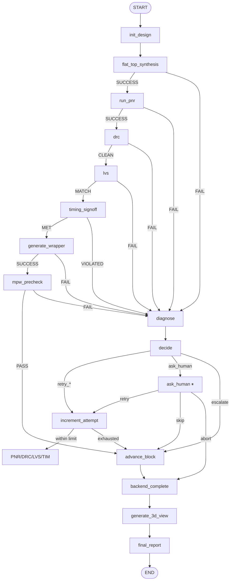

# Backend graph

The backend graph drives the chip-level physical design: flat synthesis, place-and-route, DRC, LVS, signoff timing, and the OpenFrame wrapper plus MPW precheck. It is **LLM-driven, not headless** — every EDA tool invocation runs through an LLM that adapts a TCL template, executes it, interprets the output, and emits structured JSON.

Source: [`orchestrator/langgraph/backend_graph.py`](https://github.com/facebookexperimental/coresmith/blob/main/orchestrator/langgraph/backend_graph.py) (~2000 lines) and [`backend_helpers.py`](https://github.com/facebookexperimental/coresmith/blob/main/orchestrator/langgraph/backend_helpers.py) (~1550 lines).

## Topology



## "Driven via MCP, not headless"

Every PnR / DRC / LVS / timing / synthesis node calls `_run_llm_eda_step` (`backend_graph.py:155-207`). This wraps a `ClaudeLLM` (with `Bash`, `Read`, `Write`, `Edit` tools enabled) and gives it:

1. A baseline TCL or shell template (from `pdk_templates/sky130/`).
2. A design context dict (paths, parameters, prior failure context).
3. A step-specific system prompt (e.g. `prompts/backend_pnr_llm.md`).

The LLM reads the template, adapts it for this design, runs OpenROAD / Magic / Netgen / Yosys via `Bash`, parses outputs, and returns a structured JSON result. The Python graph does *not* shell out to OpenROAD directly; the LLM layer does.

This is why the file header says "driven via MCP, not headless" — the natural way to operate the backend graph is to run an MCP / outer agent that keeps watching for interrupts.

## State (`BackendState`)

Defined at `backend_graph.py:72-146`.

### Setup

| Field | Type | Note |
|---|---|---|
| `project_root` | `str` | Run directory |
| `target_clock_mhz` | `float` | Timing target |
| `max_attempts` | `int` | Retries per phase |
| `frontend_blocks` | `list[dict]` | Output of the frontend pipeline |
| `architecture_connections` | `list[dict]` | Reference only |
| `design_name` | `str` | Top module name (`chip_top` or design top) |
| `block_rtl_paths` | `dict[str,str]` | `{block_name: rtl_path}` |

### Flat-design artifacts

| Field | Note |
|---|---|
| `integration_top_path` | `rtl/integration/{design}_top.v` |
| `flat_netlist_path` | `syn/output/{design}/{design}_netlist.v` |
| `flat_sdc_path` | `syn/output/{design}/{design}.sdc` |
| `synth_gate_count` | From Yosys |
| `synth_area_um2` | Estimated |

### Per-attempt routing

| Field | Note |
|---|---|
| `attempt` | 1-indexed |
| `phase` | `init` / `synth` / `pnr` / `drc` / `lvs` / `signoff` / `wrapper` / `precheck` |
| `previous_error` | LLM-readable error string from last failure |
| `attempt_history` | `[{attempt, phase, error, category}]` |
| `debug_result` | `{category, diagnosis, needs_human, suggested_fix, next_action}` |

### Phase results (overwritten per attempt)

| Field | Schema |
|---|---|
| `floorplan_result` | `{success, design_area_um2, die_area_um2, utilization}` |
| `place_result`, `cts_result`, `route_result` | `{success, ...}` |
| `timing_result` | `{met, wns_ns, tns_ns, setup_slack_ns, hold_slack_ns, sign_off, assessment}` |
| `power_result` | `{total_power_mw, dynamic_power_mw, leakage_power_mw}` |
| `drc_result` | `{clean, violation_count}` |
| `lvs_result` | `{match, device_delta, net_delta, llm_analysis}` |
| `precheck_result` | `{pass, checks, errors, warnings, llm_analysis}` |
| `wrapper_result` | `{success, wrapper_path, gpio_used, gpio_available, submission_dir}` |

### Persistent artifact paths

Annotated with `_last` so that parallel writes don't clobber each other.

| Field | Source |
|---|---|
| `routed_def_path` | OpenROAD route output |
| `pnr_verilog_path` | Post-PnR gate-level Verilog |
| `pwr_verilog_path` | Power-pin-augmented Verilog (VPWR/VGND) |
| `spef_path` | OpenRCX parasitic extraction |
| `gds_path` | Magic-generated GDS |
| `spice_path` | SPICE netlists from Magic for LVS |
| `wrapper_rtl_path` | `openframe_project_wrapper.v` |
| `submission_dir` | `openframe_submission/` |

### Final-report fields

| Field | Note |
|---|---|
| `viewer_3d_path` | `chip_finish/3d.html` (Three.js GDS viewer) |
| `layout_2d_png_path` | Per-block PNG |
| `final_report_path` | `chip_finish/dashboard.html` |

## Nodes

| Node | Function | Calls |
|---|---|---|
| `init_design` | `init_design_node` | Discovers `integration_top_path` and per-block RTL paths; extracts `design_name`. |
| `flat_top_synthesis` | `flat_top_synthesis_node:448` | LLM with `prompts/backend_synth_llm.md` writes a Yosys `.ys` and runs it. |
| `run_pnr` | `run_pnr_node:598` | LLM with `prompts/backend_pnr_llm.md` adapts `pdk_templates/sky130/pnr_reference.tcl` via `prepare_pnr_working_copy` (`backend_helpers.py:694`), runs OpenROAD. |
| `drc` | `drc_node:724` | LLM with `prompts/backend_drc_llm.md` runs Magic via `run_magic` (`backend_helpers.py:987`), parses `magic_drc.rpt`. |
| `lvs` | `lvs_node:814` | LLM with `prompts/backend_lvs_llm.md` runs Netgen via `run_netgen_lvs` (`backend_helpers.py:1063`). |
| `timing_signoff` | `timing_signoff_node:866` | `BackendEDAAgent.analyze("timing_signoff")` — supports a CONDITIONAL_PASS verdict for waivable violations. |
| `generate_wrapper` | `generate_wrapper_node` | LLM with `prompts/backend_wrapper_llm.md` writes `openframe_project_wrapper.v` and seeds the submission directory. |
| `mpw_precheck` | `mpw_precheck_node` | Native Efabless precheck — no Docker. Calls `run_mpw_precheck_native` (`tapeout_helpers.py:843`) on a thread. |
| `diagnose` | `diagnose_node:1239` | `tapeout_diagnosis.diagnose_tapeout_failure` LLM. Writes `pnr_overrides.json` when `auto_retry` is recommended. |
| `decide` | `decide_node` | Deterministic router based on `debug_result.next_action`. |
| `ask_human` | `ask_human_node:1360` | `interrupt(...)` with full failure context. |
| `increment_attempt` | `increment_attempt_node` | Bumps counter, picks the right retry target. |
| `advance_block` | `advance_block_node:1519` | Appends to `completed_blocks` via `operator.add`. |
| `backend_complete` | `backend_complete_node` | Writes `backend_results.json`. |
| `generate_3d_view` | `generate_3d_view_node` | Best-effort: Three.js GDS viewer + 2D PNG. |
| `final_report` | `final_report_node` | LLM-generated HTML dashboard. |

## Routers

| Router | Behavior |
|---|---|
| `route_after_flat_synth` | `SUCCESS` → run_pnr; `FAIL` → diagnose. |
| `route_after_pnr` | `SUCCESS` → drc; `FAIL` → diagnose. |
| `route_after_drc` | `CLEAN` → lvs; `FAIL` → diagnose. |
| `route_after_lvs` | `MATCH` → timing_signoff; `FAIL` → diagnose. |
| `route_after_timing` | `MET` → generate_wrapper; `VIOLATED` → diagnose. |
| `route_after_wrapper` | `SUCCESS` → mpw_precheck; `FAIL` → diagnose. |
| `route_after_precheck` | `PASS` + submission ready → advance_block; `FAIL` → diagnose. |
| `route_decision` | Maps `debug_result.next_action` → `increment_attempt` / `ask_human` / `advance_block`. |
| `route_after_human` | `retry` → increment_attempt; `skip` → advance_block; `abort` → backend_complete. |
| `route_after_increment` | Within limit → re-enter the failing phase (`run_pnr` / `drc` / `lvs` / `timing_signoff`); exhausted → advance_block. |
| `route_after_advance_lead` | Always → backend_complete (flat design = single "block"). |

## EDA tool integration

| Tool | Helper | Binary env override | Where called |
|---|---|---|---|
| OpenROAD | `run_openroad` (`backend_helpers.py:926`) | `CORESMITH_BACKEND_OPENROAD` | `run_pnr_node` |
| Magic | `run_magic` (`backend_helpers.py:987`) | `CORESMITH_BACKEND_MAGIC` | `drc_node`, `generate_3d_view_node` |
| Netgen | `run_netgen_lvs` (`backend_helpers.py:1063`) | `CORESMITH_BACKEND_NETGEN` | `lvs_node` |
| KLayout | `_run_klayout_drc` (`tapeout_helpers.py:1160`) | `CORESMITH_BACKEND_KLAYOUT` | `mpw_precheck_node` |
| Yosys | LLM `bash` directly | (PATH) | `flat_top_synthesis_node` |

Subprocess env always includes `PDK_ROOT` (e.g. `backend_helpers.py:1006`).

## PDK resolution

`backend_helpers.py:44` looks for `<project_root>/.pdk/sky130A` (or `sky130B`). If neither exists and `CORESMITH_SKIP_SYNTH=1`, PDK checks are skipped (`pipeline_helpers.py:89`). Otherwise the preflight raises.

PDK paths once resolved:

| Path | Purpose |
|---|---|
| `libs.ref/sky130_fd_sc_hd/techlef/sky130_fd_sc_hd__nom.tlef` | Technology LEF |
| `libs.ref/sky130_fd_sc_hd/lef/sky130_fd_sc_hd.lef` | Cell LEF |
| `libs.ref/sky130_fd_sc_hd/lib/sky130_fd_sc_hd__tt_025C_1v80.lib` | Liberty |
| `libs.ref/sky130_fd_sc_hd/gds/sky130_fd_sc_hd.gds` | Cell GDS |
| `libs.tech/magic/sky130A.magicrc` | Magic init |
| `libs.tech/netgen/setup.tcl` | Netgen LVS setup |
| `libs.tech/rcx/sky130hd_rcx_patterns.rules` | RCX rules |

## Failure handling

When any phase fails, the router sends the graph to `diagnose`. `diagnose_node` calls the `tapeout_diagnosis` LLM, which classifies the failure and may recommend `auto_retry` with adjusted parameters. On `auto_retry`, the node writes a `pnr_overrides.json` (e.g. lower utilization, looser density) that the next `run_pnr` invocation reads before adapting its TCL.

`decide_node` then routes:

- `retry_pnr` / `retry_drc` / `retry_lvs` / `retry_timing` → `increment_attempt` → re-enter that phase.
- `ask_human` → interrupt.
- `escalate` → `advance_block` (give up).

`route_after_increment` is where retries actually jump to the right phase. It checks `attempt > max_attempts` and bumps to `advance_block` if exhausted.

## Interrupts

`ask_human_node:1378`:

```python
payload = {
    "type": "human_intervention_needed",
    "graph": "backend",
    "block_name": ...,
    "attempt": ..., "max_attempts": ...,
    "phase": ...,
    "error": previous_error[:2000],
    "diagnosis": ..., "category": ..., "confidence": ...,
    "suggested_fix": ..., "needs_human": ...,
    "attempt_history": last_5,
    "category_counts": ...,
    "routed_def_path": ..., "gds_path": ...,
    "step_log_paths": {...},
    "supported_actions": ["retry", "skip", "abort"],
}
```

## Environment variables

| Variable | Effect |
|---|---|
| `CORESMITH_PROJECT_ROOT` | Run directory. |
| `CORESMITH_SKIP_SYNTH` | `1` skips PDK preflight. |
| `CORESMITH_BACKEND_OPENROAD` | OpenROAD binary path. |
| `CORESMITH_BACKEND_MAGIC` | Magic binary path. |
| `CORESMITH_BACKEND_NETGEN` | Netgen binary path. |
| `CORESMITH_BACKEND_KLAYOUT` | KLayout binary path. |
| `CORESMITH_LOG_DIR` | Step log dir. |
| `PDK_ROOT` | Passed to subprocess env when invoking Magic. |
