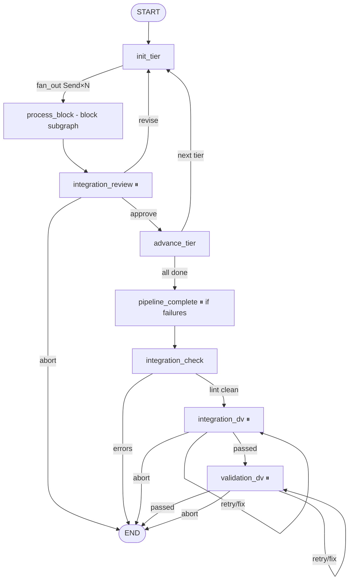
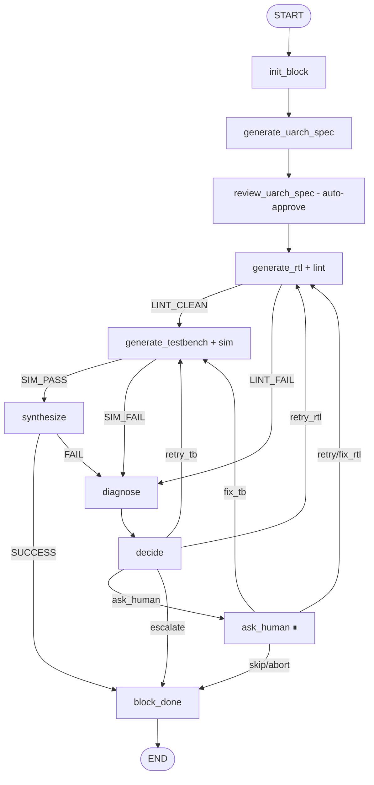

# Frontend pipeline graph

The frontend pipeline turns `block_specs.json` (from the architecture phase) into a verified, synthesized chip_top. It runs the per-block uArch → RTL → lint → TB → sim → synth loop in parallel within each tier, gates tier-to-tier progress on an integration review, and finishes with chip-level integration & validation DV.

Source: [`orchestrator/langgraph/pipeline_graph.py`](https://github.com/facebookexperimental/coresmith/blob/main/orchestrator/langgraph/pipeline_graph.py) (~3480 lines) with [`pipeline_helpers.py`](https://github.com/facebookexperimental/coresmith/blob/main/orchestrator/langgraph/pipeline_helpers.py) and [`integration_helpers.py`](https://github.com/facebookexperimental/coresmith/blob/main/orchestrator/langgraph/integration_helpers.py).

## Two graphs, not one

The frontend is split into:

- **Block subgraph** (`build_block_subgraph` at `pipeline_graph.py:1650`) — runs one block from init to done.
- **Orchestrator graph** (`build_pipeline_graph` at `pipeline_graph.py:2437`) — sequences tiers, fans out blocks into the subgraph via `Send(...)`, and runs the chip-level integration phase.

The orchestrator graph compiles the block subgraph as a node called `process_block`.

## Orchestrator topology



## Block subgraph topology



## State

### `BlockState` (per-block)

Per-block routing & lifecycle fields (defined at `pipeline_graph.py:202-261`).

| Field | Type | Note |
|---|---|---|
| `project_root` | `str` | Inherited via `Send` |
| `target_clock_mhz` | `float` | Inherited |
| `max_attempts` | `int` | Per-block retry budget (typically 5) |
| `pipeline_run_start` | `float` | Epoch; used for `_file_is_fresh` reuse decisions |
| `current_block` | `dict` | The block dict from `block_specs.json` |
| `attempt` | `int` | 1-indexed retry counter, incremented by `decide_node:1280` |
| `phase` | `str` | `init` / `uarch` / `rtl` / `lint` / `tb` / `sim` / `synth` |
| `uarch_approved` | `bool` | Set true by `review_uarch_spec_node` (per-block review is deferred to chip-level integration review) |
| `lint_clean` | `bool` | Verilator lint pass |
| `sim_passed` | `bool` | cocotb sim pass |
| `synth_success` | `bool` | Yosys synthesis pass |
| `synth_gate_count` | `int` | Cell count from Yosys |
| `rtl_path` | `str` | Generated RTL path |
| `tb_path` | `str` | Generated TB path |
| `step_log_paths` | `Annotated[dict, _last]` | `{step_name: log_path}` for outer agent to inspect |
| `debug_action` | `str` | Output of `diagnose_node`: `retry_rtl`, `retry_tb`, `ask_human`, `escalate` |
| `human_response` | `dict?` | Outer-agent action on resume |
| `force_regen_tb` | `bool` | If true, skip TB reuse even when fresh on disk |
| `completed_blocks` | `Annotated[list, operator.add]` | Reducer; appends back to orchestrator |

### `OrchestratorState` (tier-level)

Defined at `pipeline_graph.py:268-312`. Most fields use `Annotated[..., _last]` to be safe under `Send` fan-out.

| Field | Note |
|---|---|
| `block_queue` | All blocks loaded from `blocks.yaml` or `block_specs.json` |
| `tier_list` | Sorted unique tier ints (`[1, 2, 3]`) |
| `current_tier_index` | Index into `tier_list` |
| `completed_blocks` | Accumulated via `operator.add` from every parallel branch |
| `integration_review_action` | `approve` / `revise` / `abort` |
| `integration_result` | Result of `integration_check_node` |
| `integration_dv_result` | Result of `integration_dv_node` |
| `validation_dv_result` | Result of `validation_dv_node` |
| `contract_audit_result` | LLM contract audit JSON on DV failure |
| `pipeline_done` | Set true when validation DV passes |
| `pipeline_aborted` | Set true on human abort |

## Per-block loop

The full step list, with the node, helper, and pass/fail markers:

| # | Node | Helper / agent | Pass | Fail action |
|---|---|---|---|---|
| 1 | `init_block_node:338` | `create_golden_model_wrapper` | always | n/a |
| 2 | `generate_uarch_spec_node:398` | `UarchSpecGenerator.generate` (LLM, Sonnet) | spec text written | retry on LLM exception |
| 3 | `review_uarch_spec_node:458` | (none — auto-approves; chip-level review later) | `uarch_approved=True` | n/a |
| 4 | `generate_rtl_node:488` | `RTLGeneratorAgent.generate` (LLM) + Verilator lint loop (`MAX_LOCAL_RETRIES=2`) | `lint_clean=True` | `diagnose` |
| 5 | `generate_testbench_node:706` | `TestbenchGeneratorAgent.generate` (LLM) + cocotb run + local TB fix loop | `sim_passed=True` | `diagnose` |
| 6 | `synthesize_node:897` | Yosys + local fix loop | `synth_success=True` | `diagnose` |
| 7 | `diagnose_node:1021` | `DebugAgent.analyze` (LLM, Sonnet) or fast-path heuristics | sets `debug_action` | always proceeds to `decide` |
| 8 | `decide_node:1255` | deterministic router | bumps `attempt`, picks next | — |
| 9 | `ask_human_node:1316` | `interrupt(...)` | waits for outer-agent | resumes per action |
| 10 | `block_done_node:1470` | terminal | records result struct | — |

### Local fix loops

Each generator has a *local* fix loop (no LLM re-prompt; the LLM stays in the same conversation) with a 2-retry budget:

- **Lint loop** in `generate_rtl_node` — the LLM sees the Verilator output, edits, re-lints.
- **TB sim loop** in `generate_testbench_node` — the LLM sees the cocotb log, edits, re-simulates.
- **Synth loop** in `synthesize_node` — the LLM sees the Yosys error, edits, re-synthesizes.

Only when local retries are exhausted does the graph escalate to `diagnose → decide`.

### Retry budget at the graph level

`decide_node:1281` checks `new_attempt > max_attempts` and, if exhausted, forces `action="escalate"` → `block_done` (block is skipped). Otherwise it picks the next node from `debug_action`.

### mtime-based artifact reuse

`_file_is_fresh` (`pipeline_graph.py:172`):

```python
def _file_is_fresh(path: Path, state: dict) -> bool:
    run_start = state.get("pipeline_run_start", 0.0)
    if not run_start:
        return True
    return path.stat().st_mtime >= run_start
```

It is consulted in two places:

- `generate_rtl_node:540` — if `attempt == 1` and the RTL file exists and `_file_is_fresh`, skip RTL generation entirely.
- `generate_testbench_node:746` — same rule for the TB.

There's also a regression guard at `generate_rtl_node:519`: if `attempt > 1` and a prior `best_result.json` shows `sim_passed=True`, the agent will *not* regenerate RTL — it forces TB regeneration instead. The "don't break working RTL" principle.

## Tier model

A *tier* is just a `tier` integer on each block in `blocks.yaml`. `init_tier_node:1707` computes the sorted unique tier list once. `fan_out_tier:1735` yields a `Send("process_block", block_state)` for every block in the current tier. LangGraph runs them in parallel.

After all blocks in a tier finish, the orchestrator runs `integration_review_node:1784`. Then `advance_tier_node:1950` either moves to the next tier or hands off to `pipeline_complete_node:2016`.

## Tier integration review

`integration_review_node:1784` is one of the most distinctive nodes in the codebase:

- It calls `IntegrationReviewAgent.review(...)` (`langchain/agents/integration_review_agent.py`).
- The agent reads `arch/uarch_specs/{name}.md` for every block in the current tier, cross-references the architecture connections, and **edits the specs on disk** to fix port-width / direction / protocol / reset-polarity mismatches.
- It returns `{summary, issues_found, issues_fixed}`.
- The node fires *one* chip-level interrupt with payload type `uarch_integration_review`.

A subtle behavior: `issues_fixed > 0` is the **steady state**, not a problem. The agent always edits something. The router `route_after_integration_review:1971`:

- `approve` → `advance_tier`. **This is the default outer-agent decision** even when `issues_fixed > 0`.
- `revise` → `init_tier` (restart current tier with the revised uArch). Requires the outer agent to also pass `block_actions={"blk": "retry"}` for the blocks whose RTL is now stale.
- `abort` → END.

Set `CORESMITH_STRICT_INTEGRATION_REVIEW=1` to restore the old auto-revise-on-stale behavior.

## Integration phase

After `pipeline_complete_node:2049` gates on all blocks passing, three chip-level nodes run.

### `integration_check_node:2139`

1. Loads architecture connections from the block diagram.
2. Discovers block RTL files.
3. Parses all block port signatures via `parse_verilog_ports`.
4. Either generates a passthrough wrapper (single-block design) or calls `IntegrationLeadAgent.integrate(...)` to write `chip_top.v`.
5. Lints the top-level RTL with Verilator.

The integration lead is where the well-known "JSON-vs-disk" handling lives. See [Agent catalog → IntegrationLeadAgent](../agents/catalog.md#integrationleadagent).

On lint error or port mismatch the node fires an `integration_failure` interrupt with `supported_actions: [retry, fix_rtl, skip, abort]`.

### `integration_dv_node:2589`

1. Generates an integration testbench via `IntegrationTestbenchGenerator` (LLM, Opus).
2. Runs cocotb against `chip_top.v` + all block RTL.

If the previous action was `fix_rtl` or `fix_tb`, the existing TB is reused (the outer agent edited the file). Otherwise the agent regenerates.

On failure, `_run_top_level_contract_audit` (`pipeline_graph.py:2984`) calls `ContractAuditAgent`. The agent writes its structured JSON to `.coresmith/contract_audit/integration_dv_contract_audit.json` and the result is folded into the `integration_dv_failure` interrupt payload.

### `validation_dv_node:3084`

Same shape as integration DV, but:

- The TB generator reads ERS requirements (`_load_ers_validation_context:2943`) and produces application-level KPI tests.
- The generated TB must define `REQUIREMENT_COVERAGE` (the validation generator rejects TBs without it).
- On success, sets `pipeline_done = True` — the pipeline is complete.

## Interrupts

| Interrupt `type` | Node | `supported_actions` | Notes |
|---|---|---|---|
| `uarch_integration_review` | `integration_review_node:1891` | `approve`, `revise`, `abort` | `approve` is the default even when issues_fixed > 0. |
| `pipeline_incomplete` | `pipeline_complete_node:2113` | `retry`, `abort` | Some blocks failed; graph cannot continue. |
| `human_intervention_needed` | `ask_human_node:1438` | `retry`, `fix_rtl`, `fix_tb`, `add_constraint`, `skip`, `abort` | Per-block escalation; payload includes `attempt`, `phase`, `diagnosis`, `step_log_paths`, RTL/TB/uArch paths. |
| `integration_failure` | `integration_check_node:2482` | `retry`, `fix_rtl`, `skip`, `abort` | chip_top.v lint or mismatch. |
| `integration_dv_failure` | `integration_dv_node:2763` | `retry`, `fix_rtl`, `fix_tb`, `abort` (+ `skip` if `CORESMITH_ALLOW_SKIP_INTEGRATION_DV=1`) | Includes contract audit JSON in payload. |
| `validation_dv_failure` | `validation_dv_node:3370` | `retry`, `fix_rtl`, `fix_tb`, `abort` (+ `skip` if `CORESMITH_ALLOW_SKIP_VALIDATION_DV=1`) | Includes contract audit JSON. |

### Action semantics

- `retry` — restart the current node's LLM step.
- `fix_rtl` — outer agent already edited RTL on disk; re-run the failing stage *without an LLM call*.
- `fix_tb` — same for TB.
- `add_constraint` — outer agent recorded a constraint in `.coresmith/blocks/{name}/constraints.json` (RTL/TB agents consult this on next run).
- `skip` — give up on the block / stage and move on.
- `abort` — terminate the run.

## Environment variables

| Variable | Effect |
|---|---|
| `CORESMITH_PROJECT_ROOT` | Run directory; defaults to the repo root (don't!). |
| `CORESMITH_CONFIG_PATH` | `orchestrator/config.yaml` location. |
| `CORESMITH_BLOCKS_FILE` | Override path to `blocks.yaml`. |
| `CORESMITH_SKIP_SYNTH` | `1` skips Yosys + PDK preflight. |
| `CORESMITH_STRICT_INTEGRATION_REVIEW` | `1` auto-revises on `issues_fixed > 0` (old behavior). |
| `CORESMITH_ALLOW_SKIP_INTEGRATION_DV` | `1` adds `skip` to the integration DV failure interrupt. |
| `CORESMITH_ALLOW_SKIP_VALIDATION_DV` | `1` adds `skip` to the validation DV failure interrupt. |
| `CORESMITH_LOG_DIR` | Step-log output dir; defaults to `.coresmith/step_logs`. |

## Common operational notes

- **Pipeline parked at `status=done, completed_count<total_blocks, next_nodes=[]`** — the graph fell into a terminal state with work still pending. Almost always an integration-review revise loop that never advanced; archive `.coresmith/` and relaunch.
- **`fix_rtl` is trust-the-edit** — the pipeline re-runs the failing stage without re-prompting the LLM. If you didn't actually edit the file, you get the same failure.
- **`add_constraint`** writes to `.coresmith/blocks/{name}/constraints.json`, which the RTL generator's prompt reads on the next run. Use this when the LLM keeps re-introducing the same bug across retries.
