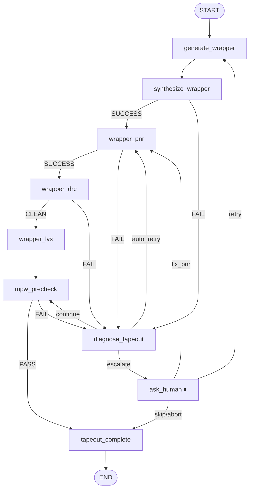

# Tapeout graph

The tapeout graph builds the OpenFrame submission from a passing backend run: it (re)generates the wrapper RTL, synthesizes and routes it on the fixed OpenFrame die (3520 × 5188 µm), runs wrapper-level DRC and LVS, then exercises Efabless's MPW precheck before producing the final submission.

Source: [`orchestrator/langgraph/tapeout_graph.py`](https://github.com/facebookexperimental/coresmith/blob/main/orchestrator/langgraph/tapeout_graph.py) (~990 lines), helpers in [`tapeout_helpers.py`](https://github.com/facebookexperimental/coresmith/blob/main/orchestrator/langgraph/tapeout_helpers.py) (~1300 lines).

## Topology



`wrapper_lvs` always proceeds to `mpw_precheck` even on mismatch — small device/net deltas from tap-cell insertion are expected and benign.

## State (`TapeoutState`)

Defined at `tapeout_graph.py:65-108`.

| Field | Note |
|---|---|
| `project_root` | Run directory |
| `target_clock_mhz` | Timing target |
| `blocks` | Frontend blocks (reference) |
| `completed_backend_blocks` | Backend results (carries GDS, DEF paths) |
| `gpio_mapping` | Explicit GPIO pad assignments (auto if `None`) |
| `phase` | `init` / `wrapper` / `pnr` / `drc` / `lvs` / `precheck` / `done` |
| `attempt`, `max_attempts` | Retry budget |
| `previous_error` | LLM-readable error context |
| `wrapper_result` | `{success, wrapper_path, gpio_used, gpio_mapping, submission_dir}` |
| `wrapper_pnr_result` | `{success, routed_def_path, design_area_um2, wns_ns}` |
| `wrapper_drc_result` | `{clean, violation_count}` |
| `wrapper_lvs_result` | `{match, device_delta, net_delta}` |
| `precheck_result` | `{pass, checks, errors, warnings}` from `run_mpw_precheck_native` |
| `submission_result` | `{submission_dir, files_copied}` |
| `diagnosis_result` | LLM triage output |
| `wrapper_rtl_path`, `wrapper_netlist_path`, `wrapper_routed_def`, `wrapper_gds_path`, `wrapper_spice_path` | Artifact paths (`Annotated[..., _last]`) |
| `submission_dir` | `openframe_submission/` |
| `tapeout_done` | Terminal flag |

## Nodes

| Node | Calls / Notes |
|---|---|
| `generate_wrapper` | If the backend already wrote `wrapper_result.json`, reuses it. Otherwise calls `tapeout_helpers.generate_wrapper` to author the wrapper RTL + GPIO mapping. |
| `synthesize_wrapper` | LLM with `prompts/tapeout_wrapper_synth.md` — authors a synthesis script (block netlists as blackboxes) and runs `"$CS" tool run_synth --script ... --json`. |
| `wrapper_pnr` | LLM with `prompts/tapeout_wrapper_pnr.md` — adapts the reference TCL and runs `"$CS" tool run_pnr --script ... --json` on the *fixed* OpenFrame die (3520 × 5188 µm). |
| `wrapper_drc` | LLM with `prompts/tapeout_wrapper_drc.md` — authors a DRC/extraction script and runs `"$CS" tool run_drc --script ... --json` (DRC + GDS export). |
| `wrapper_lvs` | LLM with `prompts/tapeout_wrapper_lvs.md` — authors an LVS script and runs `"$CS" tool run_lvs --script ... --json`. Benign pin mismatch is reconciled. |
| `mpw_precheck` | Native Efabless precheck (`tapeout_helpers.run_mpw_precheck_native:843`) — directory validation, GDS checks, `user_defines.v` generation, wrapper port validation, KLayout DRC (advisory), Magic DRC (authoritative). |
| `diagnose_tapeout` | LLM (`diagnose_tapeout_failure`) — classifies the failure and emits `auto_retry`, `continue`, or `escalate`. On `auto_retry` writes a `pnr_overrides.json`. |
| `ask_human` | Interrupts with `type=tapeout_intervention_needed`. |
| `tapeout_complete` | LLM (`prompts/tapeout_complete.md`) — validates DRC/LVS/precheck and writes a PRD-compliance assessment. Sets `tapeout_done = True`. |

## Routers

| Router | Behavior |
|---|---|
| `route_after_wrapper_gen` | Always → synthesize_wrapper |
| `route_after_wrapper_synth` | `SUCCESS` → wrapper_pnr; `FAIL` → diagnose_tapeout |
| `route_after_wrapper_pnr` | `SUCCESS` → wrapper_drc; `FAIL` → diagnose_tapeout |
| `route_after_wrapper_drc` | `CLEAN` → wrapper_lvs; `FAIL` → diagnose_tapeout |
| `route_after_wrapper_lvs` | Always → mpw_precheck |
| `route_after_precheck` | `PASS` → tapeout_complete; `FAIL` → diagnose_tapeout |
| `route_after_diagnosis` | `auto_retry` → wrapper_pnr; `continue` → mpw_precheck; `escalate` → ask_human |
| `route_after_human` | `retry` → generate_wrapper; `fix_pnr` → wrapper_pnr; `skip`/`abort` → tapeout_complete |

## Interrupt payload

`ask_human_node:737`:

```python
payload = {
    "type": "tapeout_intervention_needed",
    "graph": "tapeout",
    "phase": ...,
    "error": previous_error[:2000],
    "attempt": ...,
    "diagnosis": diagnosis_result,
    "wrapper_drc_result": ...,
    "wrapper_lvs_result": ...,
    "precheck_result": ...,
    "submission_dir": ...,
    "supported_actions": ["retry", "fix_pnr", "skip", "abort"],
}
```

`fix_pnr` is the "I edited the wrapper PnR script myself, just re-run that step" path. `retry` restarts from the wrapper generation.

## What MPW precheck actually does

`run_mpw_precheck_native` (`tapeout_helpers.py:843`) runs a sequence of checks on the submission directory without invoking Docker:

1. Validates the submission directory layout matches OpenFrame conventions.
2. Validates the `caravel_user_project` GDS / Verilog.
3. Generates `user_defines.v` from the wrapper.
4. Validates wrapper ports against the OpenFrame contract.
5. Runs KLayout DRC (advisory — informational only).
6. Runs Magic DRC (authoritative — failures here block submission).

The full LLM analysis (`prompts/backend_mpw_precheck.md`, called via `BackendEDAAgent.analyze("mpw_precheck")`) reads the precheck output and emits a structured `precheck_result.llm_analysis` so the human can see what was flagged.

## Why LVS mismatch is OK at wrapper level

Tap cell insertion during PnR adds devices that aren't in the source schematic. Wrapper-level LVS will report small `device_delta` and `net_delta` values; the rules in `route_after_wrapper_lvs` treat this as expected. Block-level LVS (in the backend graph) is strict and routes failures to `diagnose`.
