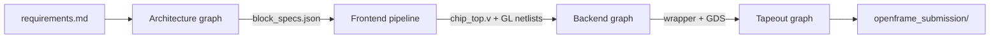

# coresmith reference

coresmith is an AI-orchestrated ASIC pipeline. Three LangGraph state machines drive a design from requirements all the way to a tapeout-ready GDS. Every code-generation and every diagnostic step is an LLM call — the graphs sequence the LLM agents, gate their outputs, and park on human-in-the-loop interrupts when judgment is required.

This site is a reference for **how the LangGraph machinery is built**: the agents, the rules between them, the architecture/frontend/backend stages, the constraint checks, and the way questions are escalated to the architect.

## The three graphs

| Graph | Source | Job |
|---|---|---|
| **Architecture** | `orchestrator/langgraph/architecture_graph.py` | PRD → block diagram → SAD/FRD/ERS → constraint check → OK2DEV gate |
| **Frontend pipeline** | `orchestrator/langgraph/pipeline_graph.py` | Per-block uArch → RTL → lint → TB → sim → synth, then tier integration → DV |
| **Backend** | `orchestrator/langgraph/backend_graph.py` | Flat synth → PnR → DRC → LVS → signoff → OpenFrame wrapper → MPW precheck |

A fourth graph, **Tapeout** (`orchestrator/langgraph/tapeout_graph.py`), wraps the design for the OpenFrame shuttle and runs Efabless's MPW precheck.

## Reading order

- New here? Start with **[Pipeline overview](overview/pipeline-overview.md)** for the 1-page mental model.
- Implementer? Jump to a specific **[graph reference](graphs/architecture.md)** or to the **[agent catalog](agents/catalog.md)**.
- Operating a live run? See **[Daemon & CLI](operations/daemon-and-cli.md)** and the **[Interrupts catalog](reference/interrupts.md)**.

## Site conventions

Code references throughout this site are written as `path:line` (e.g. `orchestrator/langgraph/pipeline_graph.py:2589`). All paths are relative to the coresmith repo root. Cited line numbers were captured against the `main` branch at the time of writing; line numbers drift, so search by symbol when in doubt.

Schema and topology tables are derived directly from the source — they are reference material, not a tutorial. Every "what does this do" question should be answerable by following the citation.
