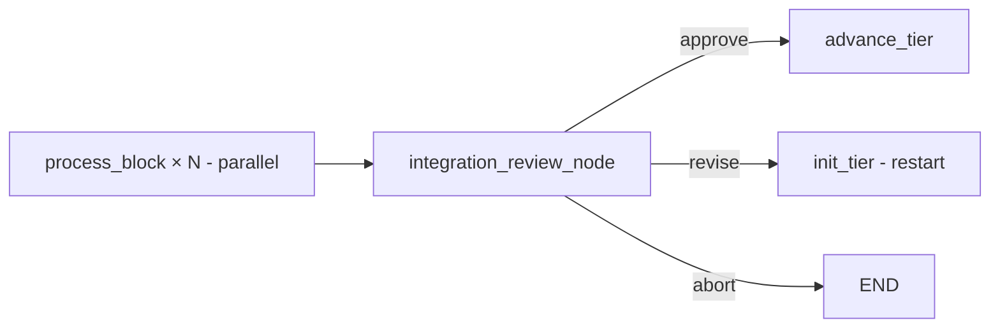

# Tiers, integration, and DV gating

The frontend pipeline's most distinctive feature is its **tiered, integration-gated** execution model. This page explains why that structure exists and how it maps onto the LangGraph topology.

## What a tier is

Every block in `blocks.yaml` declares a `tier: <int>`. Tiers are sorted (`init_tier_node:1707`) and processed in order, one tier at a time.

Within a tier, blocks run **in parallel** via LangGraph's `Send(...)` mechanism:

```python
def fan_out_tier(state):
    tier_blocks = [b for b in state["block_queue"] if b["tier"] == current_tier]
    return [Send("process_block", state_for(b)) for b in tier_blocks]
```

Each `Send` fires the entire block subgraph (uArch → RTL → lint → TB → sim → synth → done) for one block. Their `completed_blocks` outputs are accumulated by the `operator.add` reducer.

## Why tier blocks instead of running everything in parallel

Two reasons:

1. **Memory of dependencies.** A tier-2 block may need uArch specs and RTL of tier-1 blocks to author its testbench / generate its interface. Running tier-2 only after tier-1 completes guarantees those files exist.
2. **Spec consistency.** Between tiers, `IntegrationReviewAgent` reads every uArch spec in the tier *and* the connection list, and harmonizes them. Doing this once per tier instead of after every block keeps the integration review's context-window manageable and avoids contention between concurrent edits.

## The tier-tier gate: integration review

After every tier:



`integration_review_node:1784`:

1. Calls `IntegrationReviewAgent.review(tier_block_names)`.
2. Agent reads every `arch/uarch_specs/<name>.md` for tier blocks + the architecture connections.
3. Agent **edits the specs on disk** to fix any port-width / direction / protocol / reset-polarity mismatches it finds.
4. Returns `{summary, issues_found, issues_fixed}`.
5. The node fires a single `uarch_integration_review` interrupt.

The outer agent picks:

- `approve` (default) → `advance_tier`. **Even when `issues_fixed > 0`** the default is to approve; the edits are expected. If the agent had also restarted blocks (because their RTL is now stale relative to the new spec), the outer agent would also pass `block_actions={"blk": "retry"}`.
- `revise` → restart this tier. Outer agent should pass `block_actions` listing which blocks to restart from `generate_rtl` (so the RTL re-aligns to the freshly edited spec).
- `abort` → terminate.

### Strict mode

Setting `CORESMITH_STRICT_INTEGRATION_REVIEW=1` reverts the default to "auto-revise whenever `issues_fixed > 0`." Useful when you suspect spec drift is letting through bad RTL, but it dramatically increases runtime because every tier review will trigger a re-run.

### Cross-tier connections

The review agent only looks at connections among *current-tier* blocks. Connections to future tiers are explicitly deferred (`integration_review_agent.py:165-170`):

> "Deferred cross-tier/future-tier connections: N. Do not count these as current-tier issues."

This means an interface mismatch between tier-1 and tier-2 blocks won't be caught by the tier-1 review — it'll be caught by the tier-2 review when both spec files are visible.

## The all-blocks-pass gate: `pipeline_complete`

Once `advance_tier_node:1950` reports no more tiers, `pipeline_complete_node:2049` runs and checks that *every* `completed_blocks` entry has `success=True`. If any block failed, the node parks on `pipeline_incomplete` with `supported_actions: [retry, abort]`. There is no `skip` here — you cannot integrate a partially-failed design.

## Chip-top integration: `integration_check`

`integration_check_node:2139` runs once after `pipeline_complete`:

1. Load architecture connections.
2. Parse all block port signatures.
3. Single block? → generate a passthrough wrapper (deterministic, no LLM).
4. Multi-block? → call `IntegrationLeadAgent.integrate(...)` to author `chip_top.v`.
5. Lint the top with Verilator.

If lint fails or the port-mismatch list is non-empty → `integration_failure` interrupt with `supported_actions: [retry, fix_rtl, skip, abort]`.

This is where the famous JSON-vs-disk handling lives in the integration lead — Codex sometimes writes the file to disk and returns a self-include placeholder, and the agent uses the on-disk file when the response is broken.

## Integration DV

`integration_dv_node:2589` builds a chip-level smoke testbench:

1. `IntegrationTestbenchGenerator.generate(...)` writes `tb/integration/test_<design>.py`.
2. `run_integration_simulation(...)` cocotb-runs it against `chip_top.v` + all block RTL.

On failure, the node calls `_run_top_level_contract_audit:2984`. The contract audit JSON is folded into the interrupt payload so the outer agent can see what diverged at signal level before deciding.

The `fix_rtl` / `fix_tb` resume actions skip the LLM regeneration — the outer agent has already edited the on-disk file, and the pipeline just re-runs the failing stage with whatever's on disk.

## Validation DV — the application-level gate

`validation_dv_node:3084` is structurally similar to integration DV, but:

- The TB generator reads ERS requirements (`_load_ers_validation_context:2943`) and writes application-level KPI tests.
- The generated TB **must** define `REQUIREMENT_COVERAGE` (the generator rejects it otherwise).
- This is the gate that proves the chip does what the PRD said it should — not just that it handshakes properly.

Passing validation DV sets `pipeline_done = True`. The pipeline is complete; the backend graph can start.

## Why three DV stages and not one

The DV stages correspond to three different *kinds* of bug:

| Stage | Catches | Failure cost |
|---|---|---|
| Per-block sim | Single-block logic bugs (against Python golden) | Low — narrow blame |
| Integration DV | Chip-level wiring, handshake, protocol bugs | Medium — could be any block |
| Validation DV | Application-level / KPI bugs that look fine at signal level | High — needs reasoning about the spec |

Each stage's failure mode is different, so each has its own diagnosis path. Integration & validation DV both use contract audit, but with different ERS context and different testbench-generation prompts.

## Operational notes

- **`pipeline_incomplete` is rare and bad.** It means a block failed its retry budget and you cannot integrate. The standard response is to inspect `.coresmith/blocks/<failing_block>/diagnosis.json`, decide whether the bug is in the spec or the RTL, and either re-run the architecture phase (if a spec error) or `restart_block(... from_node='generate_rtl')` with additional `add_constraint` guidance.
- **`uarch_integration_review` `revise` strands the pipeline if you don't pass `block_actions`.** Sending `revise` without telling the orchestrator which blocks to restart leaves the graph at `status=done, next_nodes=[]`. Use `restart_block` per affected block, then `approve`.
- **Contract audit confidence is conservatively biased low.** Per CLAUDE.md: "If `local_fix_possible: true` and `suggested_fix` points at specific RTL lines, the fix is usually small" regardless of the `confidence` value.
